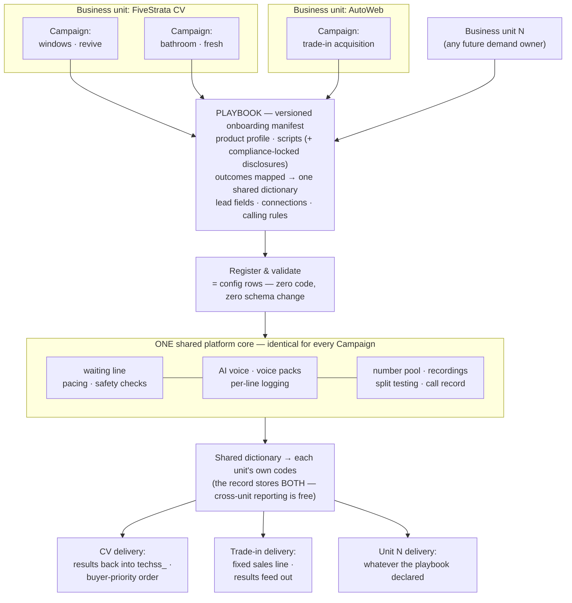
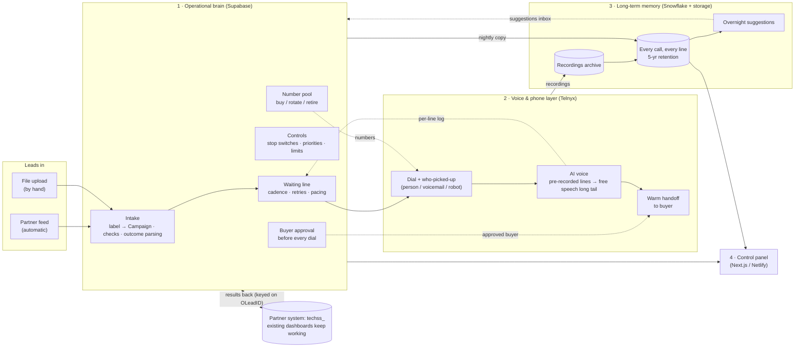

# CV AI Call Center — Platform PRD

**Status:** Draft v2 (merged, 2026-08-07) — consolidates Pier's plain-language draft
(`PRD-pier.md`, 8/6) and Sean's Draft v1 (7/27), plus the 7/17 + 7/22 scoping sessions, the
7/29 alignment sync, the V1 post-mortem, and the Telnyx capability review. Supersedes both.
**Owners:** Pier Madsen (project, final say on design) · Sean Stott (product/architecture) —
direction from Payam.

**How to read this.** Sections 1–12 are written in plain language on purpose: anyone should be
able to read them without knowing the tech or the industry. Sections 13–15 are the working
back-matter — provenance, workstreams, dependencies — for the people building it. Build-level
detail (exact fields, provider settings, cost tables) lives in the design notes in §15; this
document is the plan, not the wiring diagram.

---

## 1. What we're building

An outbound AI call center that turns leads the company already owns into sales.

A "sale" happens when the AI gets an interested person on the phone and connects them to a
company that buys those calls. The platform's job is to run those calls at scale, give the team
full control over how they run, and let them test and improve them over time.

Two things make this more than a single call center:

- **It's self-serve.** A team sets up and runs its own calling efforts without an engineer in
  the loop. They build the calls, load the people, manage the phone numbers, test versions
  against each other, and read the results themselves.
- **It's shared across the company.** Several business units use the same platform, each in its
  own sealed-off space. CV is first. Others (AutoWeb, Buyerlink Autos, Buyerlink Home Services)
  follow. To each team it looks like their own private platform.

Underneath the calling, the platform keeps a full record of every call it ever makes. That
record is worth as much as the calls themselves: it shows what works, it drives the improvement
loop, and it lets us compare our AI floor against the human call centers on the same measures.
The comparison is a later goal; we design the record now so it can support it.

**The one-slide version:**

---

## 2. Why we're rebuilding

There was a version one. It worked as a pilot, but it was hard-wired for a single use, hard to
see into, and hard to change without an engineer. It proved the approach and showed us what to
build differently.

**The main change is how the AI talks.** Version one had the AI speak every word out loud, live,
on every call. Version two plays polished pre-recorded lines for almost everything a call needs,
and only speaks freely for the rare moment the script doesn't cover. That makes every line
something we can log, test, and improve; it keeps the AI on script; and it is far lighter to run
at high volume.

That last point is why the design is what it is. V1's generative voice ran about **$157 per
sale** against roughly **$25–35** at the human floors, and 83% of that spend was the AI stack —
billed against dial handling, not talk time. Clips cost almost nothing to play. This is the cost
line the whole architecture is built around. (It is *why we build it this way*; §11 covers how we
judge whether it's built well.)

Everything else version one proved out carries forward: the line of people waiting to be called,
the safety checks, and the plumbing that talks to our partner. We're building version two fresh
rather than patching version one, because starting clean is faster than untangling something
hard-wired for a single use.

We build the whole platform now, not a small pilot, because AI-assisted development makes the
full build a matter of weeks rather than a quarter. **What ramps up slowly is how many calls we
make and how visible we are to clients, not how much of the platform is finished.** Carriers
spam-block aggressive dialers and big clients are AI-wary, so volume gates are operational
hygiene, not product timidity.

---

## 3. Who uses it

Everyone logs in as themselves. There's no shared password. This work touches rules about who can
be called and when, so every change has to trace back to a specific person.

Three kinds of access:

- **Admin.** Runs the whole platform. This is Pier. Can change anything and can add or remove
  team members.
- **Operator.** A team member who runs calling efforts day to day. Controls the settings in §8.
- **Viewer.** Can see everything but change nothing.

One record-keeping rule sits underneath all three: once something (a Campaign, a script, a phone
number) has been used on a real call, it can be switched off but **never erased**, so there is
always a record of what happened. Only the Admin can erase things that were never used live.

---

## 4. The Campaign

A **Campaign** is the one thing a team member sets up to make calls happen. Everything else in
the platform is either a setting inside a Campaign or a report about how a Campaign is doing.

Picture it as a single calling effort with a goal. For example: "call the people who asked about
a bathroom remodel in the last year, and connect anyone who's interested to a company that wants
to buy those calls." That whole effort, start to finish, is one Campaign.

A Campaign holds five things in one place:

1. **Who to call.** The group of people this Campaign works through.
2. **What the call sounds like.** The script, the voice, and whether it plays pre-recorded lines
   or speaks freely.
3. **When we call, and how often.** The hours it may call, and how many times it tries someone
   who doesn't pick up before giving up.
4. **Which phone numbers the calls come from.** The set of numbers it dials out on.
5. **Where an interested person goes.** The sales line we hand the call to.

Bundling all five into one object is the point. A team member sets up a Campaign once and it runs
on its own, instead of someone wiring those five things together by hand every time.

### How people get into a Campaign

A team sends us their list of people to call. Every person arrives with a label saying which group
they belong to (for example, "bathroom remodel, revived leads"). A team builds a Campaign on one
of those labels.

From then on, the team never has to hand us a list again: any new person carrying that label is
picked up by the Campaign automatically. If a group has arrived but no Campaign exists for their
label yet, they simply wait. **Nobody gets called until someone sets up a Campaign for them.**

### Creating a Campaign

Setting up a Campaign is filling out a form, not a technical project. The person creating it
provides the product details, the script, the calling hours, where interested people should be
sent, and a few rules about how often to try someone. When they save it, the Campaign exists and
can start working. No engineer is involved.

### One business unit, many Campaigns — and the layer underneath

Each part of the company that uses the platform is its own space with its own login. Inside that
space, a team runs as many Campaigns as it wants. The spaces are sealed off: one business unit can
never see another's people, Campaigns, or results.

Underneath the Campaign form sits the **playbook** — the versioned manifest that registers a
business unit's program on the platform (product profile, scripts with compliance-locked
disclosures, outcome codes mapped to one shared dictionary, lead fields, connections, calling
rules). A Campaign is what an Operator builds and talks about; the playbook is what the platform
registers. Both are configuration. Onboarding a new vertical — or a whole new business unit like
AutoWeb trade-in acquisition — touches **zero code and zero schema**.

Why this matters beyond CV: **the CV call center is the first workload, not the product.** The
product is "spin up an AI calling operation for any demand owner in days" — same core, new
manifest. Reporting stays comparable across units because every unit's outcome codes map onto one
shared dictionary that all reporting computes from. (Full spec:
`architecture/tenant-program-onboarding.md`.)

---

## 5. What happens on a call, start to finish

This is the core loop the whole platform exists to run. It's the same every time.

1. **Someone becomes due to call.** A person in a Campaign reaches the moment they're supposed to
   be tried, either for the first time or as a follow-up.

2. **Three safety checks run before anything dials.** Is it a legal hour where this person lives?
   Are we allowed to call their area? And most important, has the buyer's system confirmed this
   person can actually be sold, and given us a live sales line to send them to? If any check
   fails, or the buyer's system is slow or silent, we stop right there and don't call. **We would
   rather skip a call than make a wrong one.** (The buyer check happens *before* we dial, on every
   dial — not mid-call. ✅ 7/29, see §12.)

3. **A phone number is chosen.** The system picks a healthy number in the person's own area, since
   people are far more likely to answer a local number, and spreads calls across many numbers so
   no single one gets worn out. When we own no local number, we fall back to a shared pool —
   **never a single number**, which would burn out.

4. **The call is placed, and we work out who picked up.** The moment someone answers, the system
   determines whether it's a real person, a voicemail, or one of the phone-screening robots that
   ask who's calling. This matters twice over: it keeps our numbers on the right side of a real
   answer rate, and it means the expensive part (the AI) never switches on for a voicemail. No
   real person, no AI cost.

5. **The AI runs the conversation.** For a real person, the AI greets them, works through the
   script, answers common questions, and handles pushback. Most of what it says is polished,
   pre-recorded audio; it speaks freely only in the rare moment the script doesn't cover, and even
   then it can't say anything off-limits. **Every choice it makes is written down** — what the
   situation was, which line it played, what happened next — so we can see which lines work and
   which lose people. This is the AI doing the job a human soundboard operator does today, and
   what it learns transfers back to the human floors.

6. **An interested person is handed to a buyer.** If the person qualifies and wants to move
   forward, the call is connected to the buyer's sales line while the AI briefly introduces them,
   so the handoff feels warm rather than a cold dump. We track three stages: we attempted a
   handoff, the handoff connected, and the buyer accepted it.

7. **Everything is recorded and reported back.** The outcome is saved, the recording is stored,
   and the result is sent back into the partner's system so their existing reports keep working.
   Nothing about a call gets lost.

Branches off the main path:

- **"Call me later."** The Campaign schedules it and tries again then.
- **"Take me off your list."** Honored everywhere, immediately, across every Campaign.
- **Nobody home.** Back in line to be tried again later, up to the Campaign's limit, then left
  alone.

---

## 6. Features: what teams can see and do

The Campaign settings in §8 are the dials a team turns. These are the screens and tools they work
in.

**Watching calls happen**
- **Live board.** Real-time view of what's being called this second: calls in progress, people
  waiting, and how hard we're pushing against our limits. If the platform is at capacity and
  people are waiting, the team sees exactly that instead of a mysterious slowdown.

**Looking back at calls**
- **Call history.** Every completed call, searchable, with outcome, cost, and a link to the
  recording.
- **Recordings library.** Every call recorded and kept five years. A team can listen back and,
  over time, search recordings by what was actually said ("show me every call where the person
  mentioned price").

**Understanding performance**
- **Reports.** How Campaigns are doing on the numbers that matter: sales per hour of talking, cost
  per sale, and how often calls reach a real person — sliceable by Campaign, voice, area, buyer,
  and script version, so a high-level number can always be broken down to find what's driving it.
  Built to match the shape of the report the ops team already runs (see
  `reporting/kb-wi-dashboard-spec.md`), so the numbers are directly comparable from day one.
- **The handoff funnel.** How many interested calls reached a buyer and were accepted, at each of
  the three stages, so a drop-off is easy to spot.
- **Real answers vs fake ones.** A trustworthy count of how often we reached an actual human, kept
  separate from voicemails and screening robots, which otherwise make the numbers look better than
  they are.

**Fixing problems**
- **Diagnostics.** Follow a single person through the whole process and see exactly where and why
  something went wrong — whether a call didn't happen because of the hour, the area, the buyer's
  approval, or something else.
- **Alerts.** Flags when something needs attention: a Campaign has stalled, we've hit our call
  ceiling, or a batch of numbers is going bad.

**Building the calls**
- **Campaign builder** (§4).
- **Script and voice builder.** Write what the caller says, choose the voice, and create
  variations of individual lines so the same call doesn't sound identical every time. No engineer
  needed.
- **Split testing.** Run two versions against each other and compare them live (§8).

**Managing the plumbing**
- **Phone number manager.** The pool of numbers, each one's health, and automatic retire-and-
  replace of the bad ones.
- **Cost tracking.** What each call costs, broken down by its parts, so the team knows where the
  money goes and can compare against what the human floors cost today.
- **Buyers and priorities.** Who interested calls get sent to, and in what order when several
  buyers want the same one.

**Getting leads in**
- **Lead intake.** Two ways in, both first-class: a partner sends people to us automatically as
  they come, or a team member uploads a file by hand. Either way they land in the right place and
  are picked up by the matching Campaign. Both fresh and revived leads arrive through the same
  door — which kind a batch is gets set when it's handed in, not baked into the file. (The exact
  file layout used today, and how it lines up with the automatic feed, is recorded in
  `integrations/lead-file-format.md`; the automatic feed is expected to take over from files
  eventually, so the file layout is treated as one interchangeable way in, never the foundation.)

**The learning loop**
- **Overnight suggestions.** Each night the platform studies the day's calls and returns
  suggestions the team can act on: which phone numbers to drop, the best times to reach certain
  groups, which script version is winning. These are suggestions the platform *applies going
  forward*, not a report someone has to read and re-enter by hand.

---

## 7. How it's built (the backend)

Four connected systems, each with one job. Keeping them separate is deliberate: **the part that
makes calls is never slowed down by the part that crunches reports.**

**1. The operational brain** (a database service called Supabase)
The always-on engine. Holds the line of people waiting to be called, runs the three safety checks
before every call, decides who to dial next, and keeps every setting from §8. It also keeps the
recent history (roughly the last month) so the live screens are instant. This is the part actually
running the call center minute to minute.

**2. The voice and phone layer** (a provider called Telnyx)
Places the calls, provides the AI voice, works out who picked up, and connects the handoffs to
buyers. We rent this rather than building phone infrastructure ourselves, and we've confirmed it
does everything we need, including detecting voicemails and screening robots.

**3. The long-term memory and analysis** (a data warehouse called Snowflake, plus cheap file
storage for recordings)
Keeps every call for five years, stores all recordings, and runs the heavy overnight analysis that
produces the suggestions in §6. It never touches a live call. If it went down for a week, calling
would carry on normally and nobody on a call would notice.

**4. The control panel** (a website built with Next.js, hosted on Netlify)
What the team logs into, and where every feature in §6 lives. It reads live information from the
brain and reports from the long-term memory.

### How the four connect

- **Leads come in** two ways — partner feed or file upload — and both land in the brain, labelled
  so the right Campaign adopts them.
- **Calls run** through the phone layer, with results flowing straight back into the brain as they
  happen, so the live board and reports are current within seconds.
- **Every night**, the day's calls are copied from the brain into long-term memory. One-way, and
  built so we can make it more frequent than nightly later without rebuilding anything.
- **Suggestions flow back** from the analysis into an inbox in the brain. The engine uses a
  suggestion if it's there and falls back to its normal setting if it isn't. **The brain never
  waits on the analysis to make a call.**
- **Recordings** go to cheap storage, catalogued so they can be found later.
- **Results are sent back** to the partner's system after every call, keyed on the same lead ID
  they already use (`OLeadID`), so all their existing reports and dashboards keep working exactly
  as before.

### Build rules that hold everything together

- **Each business unit is sealed off.** One underlying database, but the system enforces that no
  unit can ever see another's people or results.
- **The safety checks fail closed.** If a check can't be completed, the answer is "don't call,"
  never "call anyway." **This is the single most important rule in the build.**
- **Nothing in the call path waits on anything slow.** Every external call is asynchronous; we ask
  ahead of time rather than mid-call.
- **Passwords and secret keys never live in the code.** They sit in a separate protected place.
- **We speak the human floors' language.** We keep the existing dialer vocabulary — outcome codes,
  list and campaign semantics, and the same lead key — so our numbers compare one-to-one with KB,
  TD and CD. We run none of their software.
- **We're building version two fresh, not patching version one.** A first piece of the new brain
  already exists.

### Handling a lot of calls at once

The phone layer can only run so many calls at the same time, and that limit is something we buy
more of when we need it. The engine is built to run right up to that limit and hold a tidy line
when we hit it, instead of hammering the system, and the team sees the limit plainly on the live
board. Scaling to tens of millions of calls a month is a purchasing decision, not a rebuild.
(Detail: `architecture/concurrency-queueing.md`.)

---

## 8. What teams can control (and the few things they can't)

The whole reason this platform exists is to hand control to the team running the calls, instead of
hiding those choices inside code only an engineer can change. So: **almost everything about how a
Campaign runs is a setting a team member can change**, and each ships with a sensible starting
value so nobody has to be an expert to get going.

A small number of things are locked, only because the law or basic safety requires it. Those are
called out plainly at the end.

Three kinds of control — **Open** (the team sets it up from scratch; there's no meaningful
default, because the setting only exists once someone fills it in), **Adjustable** (ships with a
working starting value, changeable any time), **Locked** (nobody turns it off). Three kinds of
people — **Admin**, **Operator**, **Viewer** (§3).

### Who we call, and in what order

| Setting | What it does | Starting value | Who changes it | Applies to |
|---|---|---|---|---|
| The group a Campaign calls | Picks which people this Campaign works through | Open (set when the Campaign is built) | Operator | One Campaign |
| Calling order | Newest people first or oldest first | Newest first for fresh lists, oldest first for revived lists | Operator | One Campaign |
| Skip the least likely to answer | Leaves out people the system has learned probably won't pick up | Off at first (turns on once we've learned enough) | Operator | One Campaign |

### What the call sounds like

| Setting | What it does | Starting value | Who changes it | Applies to |
|---|---|---|---|---|
| Voice style | Whether the caller plays pre-recorded lines or speaks freely | Pre-recorded for busy Campaigns, free speech for small or brand-new ones; a Campaign can graduate from one to the other | Operator | One Campaign |
| The script | What the caller says, step by step | Open (written when the Campaign is built) | Operator | One Campaign |
| Line variations | Several versions of the same line so calls don't sound identical | 3–5 variations on the most-used lines | Operator | One Campaign |
| Spoken brand name | Whether the caller names a brand on the call | Off | Operator | One Campaign |
| The voice | Which voice does the talking | Chosen from a set of ready voices | Operator | One Campaign |

### When we call, and how often

| Setting | What it does | Starting value | Who changes it | Applies to |
|---|---|---|---|---|
| Calling hours | The hours of day it may call | The legal hours for each person's location | Operator can narrow it, never widen it past the legal limit | One Campaign |
| Number of tries | How many times to call someone who doesn't answer | A set number of attempts | Operator | One Campaign |
| Gap between tries | How long to wait before calling the same person again | A set number of hours | Operator | One Campaign |
| Best time to reach someone | Nudges calls toward the times a group tends to answer | Off (turns on once we've learned the pattern) | Operator | One Campaign |
| Pace | How fast we dial, held near the human floors' rate so carriers stay comfortable | Matched to human-floor rates | Operator | One Campaign |

### The phone numbers we call from

| Setting | What it does | Starting value | Who changes it | Applies to |
|---|---|---|---|---|
| Match number to area | Calls people from a number in their own area | On | Operator | Business unit |
| Retiring a tired number | Drops a number automatically once people stop answering it or carriers start blocking it | On, with starting limits for "too few answers" and "too many blocks"; checked nightly | Operator can adjust the limits | Business unit |
| Backup when no local number exists | What to call from when we own no number in someone's area | A shared backup pool — never a single number, which would burn out | Operator | Business unit |
| Size of the number pool | How many numbers we keep on hand | Sized to expected call volume | Operator | Business unit |
| Calls per number | Retire-and-replace ceiling per number | ~1,500 dials | Operator | Business unit |

### How many calls happen at once

| Setting | What it does | Starting value | Who changes it | Applies to |
|---|---|---|---|---|
| Most calls at the same time | The ceiling on how many calls run at once | Set to what we've bought from the phone provider | Admin (it costs money and is bought in advance) | Whole platform, with a share reserved per Campaign so one can't crowd out the rest |

### Where interested people go

| Setting | What it does | Starting value | Who changes it | Applies to |
|---|---|---|---|---|
| The sales line | Who an interested person gets connected to | Comes from the buyer's own system | Operator confirms it | One Campaign |
| Order of buyers | When several buyers want the same call, who gets first shot | Even split | Operator | One Campaign |

### Trying two versions against each other

| Setting | What it does | Starting value | Who changes it | Applies to |
|---|---|---|---|---|
| Split test | Runs two versions of a Campaign side by side (two scripts, two voices, two calling patterns) and sends part of the people to each, so the team sees which wins | Off | Operator sets it up | One Campaign |

### Safety switches

| Setting | What it does | Starting value | Who changes it | Applies to |
|---|---|---|---|---|
| Stop everything | Halts all calling immediately. Calls in progress finish normally | Off | Admin or Operator | Whole platform |
| Stop one Campaign | Halts calling for a single Campaign | Off | Operator | One Campaign |
| Stop calls to one buyer | Halts calls headed to a specific sales line, leaving the rest running | Off | Operator | One buyer (down to a single source-and-area combination) |
| Stop after the first success | Pauses a brand-new Campaign the moment it connects its first person, as a safety check during testing | On while testing | Operator | One Campaign |

### Who's allowed to do what

| Setting | What it does | Starting value | Who changes it | Applies to |
|---|---|---|---|---|
| Team members and their access | Adds or removes people and sets Admin / Operator / Viewer | Set up by the Admin | Admin only | Whole platform |
| Deleting something that already made real calls | Once used on a live call, a Campaign, script or number can be switched off but not erased | Anyone can switch things off; only Admin can erase things never used live | Admin for anything that touched a real call | Whole platform |

### Locked on purpose

Not settings. No one turns these off, including the Admin, because they keep us on the right side
of the law and protect the business:

- We only call people during the legal calling hours for where they live.
- We never call a number on a Do Not Call list.
- We never connect someone to a buyer unless the buyer's system approved that person first. If
  that approval is slow or fails, we don't make the call at all.
- Compliance disclosures inside a script are locked — a split test can never vary them.

---

## 9. Build order

No dates here; dates live in `roadmap.md`. The order is driven by what depends on what.

1. **Lock the record format first.** Decide exactly what we save for every call. Reports, testing
   and every comparison are built on top of it, so it has to settle before those can be built.
2. **Prove one real call end to end.** Place a single real call as a throwaway test: run the
   safety checks, have the AI talk, connect a handoff, save the result. Cheap, and it de-risks
   everything downstream.
3. **Build the calling engine and the control panel in parallel.** The engine can be built while
   the control panel starts with look-only screens, which carry no risk because they only read.
   Then add the screens that change things.
4. **Add the long-term memory and the overnight analysis.** Once the record format is locked, stand
   up the nightly copy and the suggestions that flow back.

A first piece of the brain already exists, so this is not starting from zero.

---

## 10. The rules we never break

- **Don't call unless it's safe.** No call goes out unless the buyer approved the person and gave
  us a live sales line. If anything about that is slow or unclear, we don't call.
- **Only call during legal hours** for where the person lives.
- **Honor "do not call" immediately,** everywhere, the moment someone asks.
- **Never fall back to a single worn-out number.** No local number means a shared backup pool.
- **Keep passwords and keys out of the code.**
- **Never write anyone's personal information into shared project files.** Summarize; leave the
  private details out.

---

## 11. How we measure success

Two different bars, and keeping them apart is what makes this section useful.

**The platform is judged on what it can do.** This is the build bar — whether we built the right
thing:

- It runs outbound calls at scale, up to the limit we have bought.
- Teams set up and run their own calling efforts without an engineer.
- Teams can test versions against each other and use the results to improve.
- More than one business unit runs on it at once, sealed off from each other.
- A new calling effort, or a new business unit, can be set up in days, not weeks.
- We reach a real person often enough for the calls to be worth making, with real people counted
  honestly and kept separate from voicemails and screening robots.
- Every call and every line of every call is recorded, retrievable, and comparable across units.

**Business economics decide how far we open the taps.** Cost per sale and sales per hour are each
business unit's numbers, on their own leads — the platform's job is to give them those numbers and
the controls, not to hit a particular one. But for CV's own pilot they are also the gate on
*volume*: cost per completed handoff against the human-floor baseline (roughly $25–35 at KB), the
honest real-person answer rate, sales-per-talk-hour, and how much of a call is covered by
pre-recorded lines. Those numbers decide whether we scale calling, and they are the direct answer
to the revenue-linkage test the platform was commissioned against.

A platform that passes the first list and fails the second is built correctly and shouldn't scale
yet. That's the distinction worth holding.

---

## 12. Decisions and open questions

### ✅ Decided

| Decision | Who / when |
|---|---|
| Augment the human floors, don't replace them | settled by V1 |
| No dialer instance of our own — we keep the vocabulary, not the software | ✅ PRD v1, Sean 7/27 (fork closed 7/23, `ac4357e`) |
| Supabase brain + Telnyx call path + Snowflake long-term memory | ✅ PRD v1, 7/27 |
| Pre-recorded lines first, free speech only for the long tail; the AI does the soundboard operator's job | ✅ PRD v1, 7/27 |
| Both voice styles ship; each Campaign picks, and can graduate between them | ✅ 7/29 sync |
| No human screener or closer anywhere in a call | ✅ PRD v1, 7/27 |
| The buyer's approval happens **before we dial, on every dial** — not mid-call | ✅ 7/29 (Joseph confirmed the volume is fine; mid-call design existed only for the branding case) |
| We're paid for the transfer *attempt*, even when the buyer doesn't pick up | ✅ 7/29 |
| The engine is built for a hard concurrency ceiling from day one | ✅ 7/29 |
| The Campaign is the one object a team works with; a business unit runs many at once | ✅ Pier draft, 8/6 |
| Business units sealed off from each other on one shared system | ✅ 7/23 |
| Playbook onboarding — a new vertical or unit is config, not code | ✅ 7/23 |
| Split testing by dividing who gets which version | ✅ 7/22 |
| Numbers managed automatically: pool, area-matched, retired when bad; nightly check is enough | ✅ 7/22 + 7/31 study |
| Every call kept five years; recent calls also in the fast brain for live screens | ✅ 7/22 |
| Results sent back to the partner's system after every call | ✅ 7/22 |
| Named-user login, three roles, and no erasing anything that touched a live call | ✅ Pier draft, 8/6 |
| Version two built fresh rather than patching version one | ✅ Pier draft, 8/6 |
| One build, exposure ramps — we don't phase functionality | ✅ PRD v1 §1 |
| Pilot: revived leads, one existing vertical, not home warranty | ✅ 7/17 |

### ➤ Direction (not yet decided)

- What to call from when we own no local number — nearby area code, national, or toll-free.
  Leaning toward the shared backup pool.
- Whether one lead label can feed more than one Campaign. Leaning toward one-to-one.
- How long recent calls stay in the fast brain before moving to long-term. Leaning ~90 days.
- Starting size of the number pool. Leaning 50–100, retiring bad ones from day one.

### ❓ Open

- **Partner contracts we still need:** the exact format of the leads CV will send us, the exact
  format for sending results back, and how Do Not Call scrubbing is divided between us and them.
  *(Joseph — see §14.)*
- **Recording consent** in states that legally require telling people a call is recorded. Needs a
  clear rule before we scale.
- **How each business unit's private keys and credentials are stored** once more than one unit is
  on the platform.
- **What happens when a buyer doesn't pick up a handoff** — the crediting side is settled (we're
  paid for the attempt); the caller-experience side isn't. *(Kinsey.)*
- **Formal pilot thresholds** — the specific numbers that mean "scale it." *(Sean + Pier → Payam.)*

---

## 13. Workstreams and gates

| # | Workstream | Gate / exit criterion | Owner(s) |
|---|---|---|---|
| W1 | Voice engine bake-off — see `architecture/soundboard-llm-interface.md` (the AI as a constrained line-picker; free speech as a guarded escape hatch) | Clip playback seam a human can't hear (~200ms); cost-per-connected-minute model against the human-floor baseline | Sean + Pier |
| W2 | Warm-handoff leg | Bridged test handoff with all three stages logged, crediting rule signed off | Sean, Joseph |
| W3 | Intake contracts | Lead payload spec, buyer pre-approval contract, DNC handling | Joseph |
| W4 | Results relay + write-back | Long-term memory landing live; results-back contract agreed | Sean, Cromwel, Shelly Teh |
| W5 | Cost approval | Running-cost outline approved | Sam / Tatevik (Pier drives) |
| W6 | Voice pack pipeline | First pack (lines + variations) generated for the pilot script | Sean + Ashley |
| W7 | Reporting sign-off | Ops confirms the views match the workbook they run today | Sean → Ashley |
| W8 | Control panel | Look-only screens live, then the screens that change things | Pier |

## 14. Dependencies and stakeholders

Telnyx account fully enabled — ✅ **corporate credit card landed 2026-08-07**; test number
purchased and the call path provisioned the same day. The remaining step-2 dependency is a
**public webhook endpoint** (IT) · lead payload, buyer pre-approval and DNC
surface (Joseph) · long-term memory setup (Shelly Teh) · running-cost approval (Sam / Tatevik) ·
outcome-code dictionary (Brandon / Joseph / Cromwel) · pilot script and reporting sign-off
(Ashley) · crediting rules (Kinsey) · AutoWeb playbook (Jina Yoon, Ammie Lin, via Pier).

## 15. Out of scope, and where the detail lives

**Out of scope for this version:** human agent seats or scheduling · replacing the human call
centers · redoing revived-lead sourcing across all call centers (deferred 7/22) · client-facing AI
positioning (quiet until the numbers win) · **SMS follow-up** — a channel extension the design
accommodates but which is not in this scope and would be its own scoped addition.

**Detailed specs:**

- The exact fields saved for each call, and the reporting views on top: `supabase/migrations/`
- The soundboard-style AI design: `architecture/soundboard-llm-interface.md`
- Handling many calls at once: `architecture/concurrency-queueing.md`
- The phone-number studies behind automatic retirement: `reporting/td-windows-did-study.md`,
  `reporting/kb-did-study.md`
- Phone-provider capabilities and pricing: `architecture/telnyx-capability-review.md`
- The overnight-suggestions design: `architecture/snowflake-value.md`
- The multi-business-unit setup: `architecture/tenant-program-onboarding.md`,
  `architecture/multi-tenant-topology.md`
- The version-one post-mortem (where the cost lesson comes from): `architecture/v1-build.md`
- The reporting spec we sign off against: `reporting/kb-wi-dashboard-spec.md`
- Platform evaluation and the options fork that closed: `architecture/platform-foundations.md`
- Scoping sessions and meeting notes these decisions came from: `meetings/`, `transcripts/`
