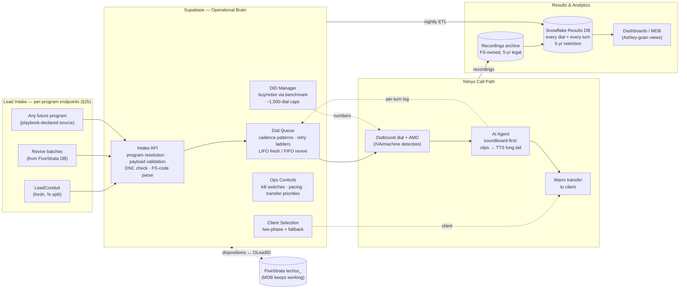
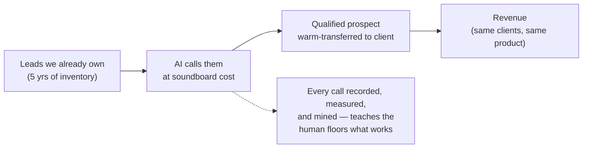
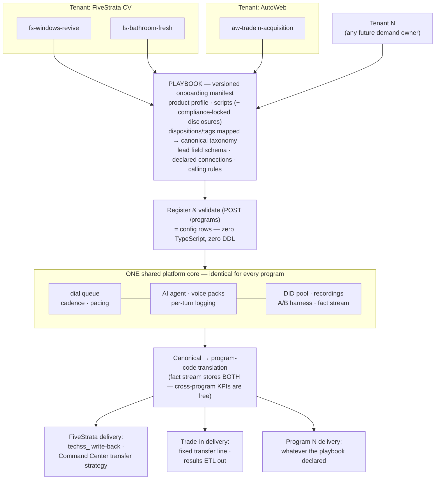
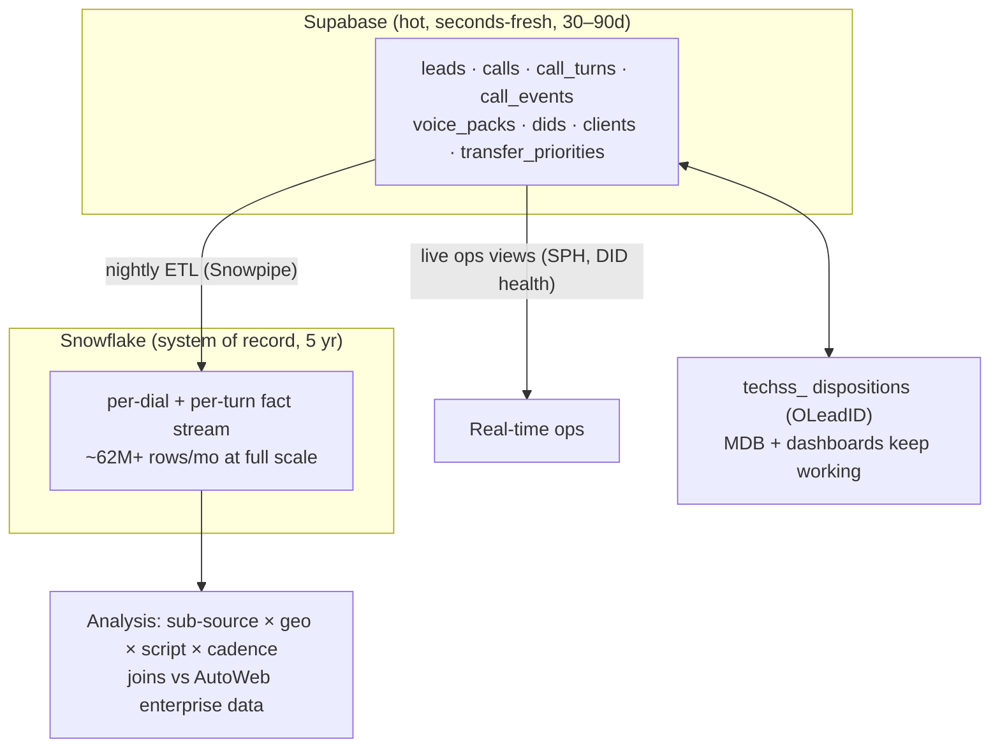

# AICC — AI Call Center Platform · PRD

**Status:** Draft v1 (Sean, 2026-07-27) — assembled from the 7/17 + 7/22 scoping sessions, the redlined scope outline, the V1 post-mortem, and the Telnyx capability review. Awaiting merge with Pier's draft.
**Owners:** Sean Stott (product/architecture) · Pier Madsen (project) — direction from Payam.

---

## 1. The decision

> We are building a **complete, self-contained AI call center** the CV team operates at will — not a pilot experiment. **Supabase** runs the operational brain (queue, routing, controls), **Telnyx** carries the calls, an **AI agent replaces the soundboard operator** (canned clips first, TTS for the long tail), and **Snowflake** keeps every call and every conversational turn for five years. No ViciDial instance — we keep its vocabulary (dispositions, lists, campaigns) so our data compares one-to-one with the human floors. No human screener or closer anywhere in the call path.
>
> V1 (Retell) proved the architecture and exposed the flaw: pure generative voice cost ~$157/sale vs ~$25–35 at KB. The soundboard-first hybrid attacks exactly that cost line. Everything else V1 validated — queue orchestration in Postgres, FS-code fluency, OLeadID keying — carries forward.
>
> We build the whole platform now — AI-assisted development makes the full scope a ~3-week build, not a quarter. What ramps gradually is **exposure** (dial volume, client visibility), not functionality: carriers spam-block aggressive dialers and big clients are AI-wary, so volume gates are operational hygiene, not product timidity.

## 2. System at a glance

**For the one-slide version (CFO/Payam):**

### 2b. The differentiator: tenant-agnostic intake — one platform, many programs

A **program** (a product + script family + disposition contract + delivery target, within a
**tenant** business unit) is the unit of onboarding. Onboarding a new vertical — or a whole new
business unit like AutoWeb trade-in acquisition — touches **zero code and zero schema**: a
validated playbook manifest becomes config rows, and the identical platform core runs it.
FiveStrata is simply tenant zero. (Full spec: `architecture/tenant-program-onboarding.md`.)

Why investors should care: the CV call center is the **first workload, not the product**. The
product is "spin up an AI calling operation for any demand owner in days" — same core, new
manifest. Cross-program KPIs stay comparable because every program's dispositions map onto one
canonical dictionary that all reporting computes from.

## 3. Why (business case)

- **Revenue linkage is the test for every feature** (Payam directive): the platform produces revenue directly (transfers from leads we already own) or teaches optimizations that transfer to KB/TD/CD.
- **The cost math:** KB's human sites run ≈ $6.23–7.43/hr (≈ $25–35/sale at current SPH); KB's own AI blend ≈ $5.86–5.96/hr *and still pays BareTel infrastructure + soundboard licenses*. Our stack pays neither. V1's failure was per-minute generative pricing (83% of spend was the AI stack, billed against dial handling, not talk time); clips cost ~nothing to play.
- **Differentiators no vendor offers:** benchmark-driven individual DID retirement, real-vs-fake contact (IVA) classification, per-turn script optimization with logged decisions, sub-source × geo routing honoring client constraints (Sunrun URL rules), zero-marginal-cost branding.
- **Strategic capacity:** test bench (change one variable, measure), new-product lane (hot transfers), fast vertical spin-up, disaster fallback — and, per Payam via Andre, a general "spin up an AI agent" platform (e.g. AutoWeb SMS follow-up) — the multi-tenant topology makes that config, not code.

## 4. What we're building (full scope, one build)

**P0 — the must-haves (Pier, 7/22)**
1. **Results database** — every dial + every turn, Snowflake, OLeadID-keyed, two-way techss_ write-back.
2. **Recording storage** — everything archived, FS-owned, 5-yr legal retention; hot 1–2-month analysis window.
3. **DID management** — pool buy/rotate/retire via Telnyx API, per-DID benchmarks, ~1,500-dial caps.
4. **A/B testing** — agents, scripts, voice packs, and cadence patterns head-to-head (batch A → pattern 1, batch B → pattern 2).

**P0 — the call machine**
5. Intake API (LeadConduit recipient + revive endpoint; DNC inheritance; FS-code parsing to first-class columns).
6. Dial queue with testable cadence variables (hour-gap, daypart, wait-time; LIFO/FIFO), pacing matched to human-floor rates (carrier hygiene), TZ-aware windows.
7. AI agent, soundboard-first: clip selection policy over voice packs (clips + TTS voice + script version, swappable as a unit; 3–5 rotating variants on high-frequency slots), per-turn logging (context → clip/variant → outcome), canned-vs-TTS second telemetry.
8. Warm-transfer leg: two-phase client selection (pre-auth default → re-request at qualification → fallback), bridge + whisper, tAtt/tSucc/tAgree instrumented, crediting rules recorded.
9. IVA/connection classification: AMD + live IVA disposition; connection rate as the trustworthy KPI.
10. Ops controls: kill switches (global, per-program, per-client at SC×CP granularity — the Sunrun pattern, native), transfer priorities (Command Center emulation), volume throttles.

**P0 — the platform layer**
11. Multi-tenant topology: tenant → program mapping; playbook onboarding (product profile, scripts + disclosures, disposition/sentiment mapping to canonical taxonomies, declared connections) — new vertical or business unit onboards as config.
12. Reporting in Ashley's grain: rDaily/rList-equivalent views (built — migration 0002), media-partner tagging per call, per-call-updated DID view.

**Deliberately NOT phased out of v1:** none of the above. The build is one shot; see §6 for what *is* gated.

## 5. Data architecture

Supabase = OLTP (call path never leaves it — async always); Snowflake = OLAP (nothing interactive runs through it). VICIdial vocabulary (dispositions decoded via `techss_dl.callcenter_dispos`, list/campaign semantics, `vendor_lead_code` ≡ OLeadID) with compat views if table-level comparison is ever wanted.

## 6. Workstreams, owners, gates

| # | Workstream | Gate / exit criterion | Owner(s) |
|---|---|---|---|
| W1 | Voice engine bake-off (Telnyx-native vs Retell vs BYO loop) | Clip playback latency PoC ≤ human-soundboard seam (~200ms); cost/connected-min model vs KB baseline | Sean + Pier (needs T2 keys) |
| W2 | Warm-transfer leg | Bridged test transfer with tAtt/tSucc/tAgree logged + crediting rule signed off by Kinsey | Sean, Joseph (T4 spec) |
| W3 | Intake contracts | LeadConduit payload spec (F8), pre-auth endpoint contract, DNC inheritance (T3/T4/T11) | Joseph |
| W4 | Results relay + write-back | Snowflake landing live (Shelly Teh); techss_ write-back contract (T6) | Sean, Cromwel, Shelly Teh |
| W5 | Cost approval | Telnyx/Supabase/Snowflake outline approved | Sam/Tatevik (Pier drives) |
| W6 | Voice pack pipeline | First pack generated (clips + variants) for pilot vertical script | Sean + Ashley (script) |
| W7 | Dashboard emulation sign-off | Ashley confirms rDaily/rList views match her workbook | Sean → Ashley |

## 7. Exposure ramp (not build phases)

1. **Dark launch:** full platform, internal test numbers only. Everything works; nobody outside sees it.
2. **Quiet volume:** revive leads, one vertical (not HW), small % of the upstream split; pace matched to human floors. Clients not told (Kinsey's client-wariness strategy).
3. **Scale by evidence:** volume follows connection-rate + $/transfer benchmarks; client conversations start when the numbers win.

## 8. Success measures

$/qualified-transfer vs KB/TD/CD baselines · connection rate (IVA-adjusted) · SPH-equivalent per talk-hour · canned-coverage % (target: TTS on long tail only) · transfer funnel conversion (tAtt→tSucc→tAgree) · time-to-onboard a new program (playbook, target: days not weeks).

## 9. Dependencies & stakeholders

Telnyx keys (T2, Pier) · LeadConduit + pre-auth + DNC specs (Joseph) · Snowflake (Shelly Teh) · cost approval (Sam/Tatevik) · disposition dictionary (Brandon/Joseph, T6/F-questions) · script + dashboard sign-off (Ashley) · crediting rules (Kinsey).

## 10. Out of scope

Human agent seats/scheduling (no human layer, decided) · replacing KB/TD/CD (augment, not replace — settled by V1) · automated revive *sourcing* re-do across all call centers (deferred 7/22) · client-facing AI positioning (quiet until numbers win).
