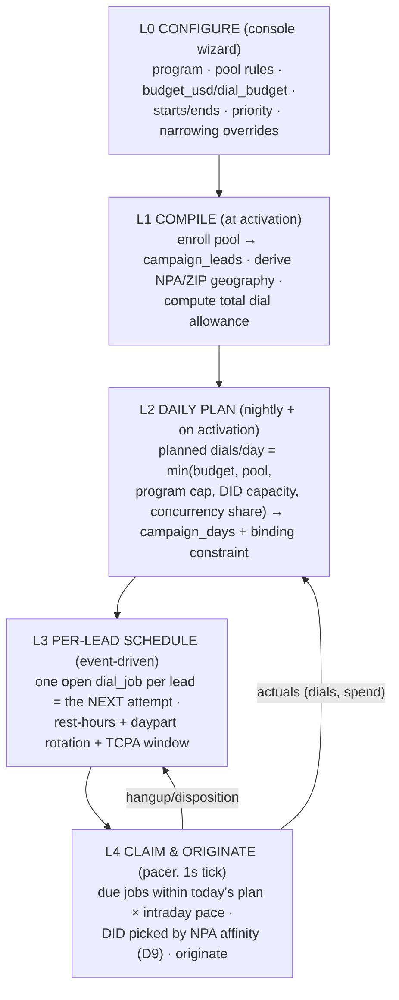

# Campaign Delivery (budget × time → dials/day → per-lead schedule → ZIP+DID)

Draft v1, Sean 2026-08-17; renamed from "campaign cascade" 8/18 — **delivery** is the
adtech term for exactly this layer (budget + flight dates → pacing → per-impression serving),
so the vocabulary lands natively with the AutoWeb audience. Prompted by the Ammie call (a
tenant will configure bounded runs — a list, a budget, a window) and by the general need to
consume arbitrary FiveStrata inventory the same way. This doc defines the **campaign** entity
and the deterministic cascade from its console config down to individual originations. Builds on
`tenant-lead-sourcing.md` (0007 cadence + pool rules), `concurrency-queueing.md` (pacer/slot
ledger), `did-lifecycle.md` (D9 DID selection), `control-panel-scope.md` (Phase 2 screens
1–2, which this doc now specifies).

---

## 1. Where "campaign" sits in the model

```
tenant → program → CAMPAIGN → enrollment → dial_jobs → calls
```

**Program = the durable playbook** (script, voice pack, buyers, dispositions, sourcing
rules, cadence defaults, compliance hours). **Campaign = a bounded execution of a program**:
a lead pool + a budget + a timeframe, plus optional narrowing overrides. Programs live for
months; campaigns start, run, and complete. ViciDial vocabulary is kept deliberately —
`calls.campaign_id` (text, vestigial) is superseded by a real `calls.campaign_uuid` FK.

**Invariant — campaigns may only NARROW program constraints:** calling hours intersect
(never widen), `max_dials_per_lead` ≤ program's, `min_rest_hours` ≥ program's. Compliance
posture stays program-level; a campaign can't opt out of it. Enforced at write time (RPC
validation), not trusted to the UI.

## 2. The cascade — five levels



Each level is a pure function of the level above plus observed actuals — the whole cascade
is recomputable, so a config edit (budget raise, date extension, pause) takes effect at the
next plan tick with no migration of in-flight state.

## 3. L1 — compile: pool, allowance, geography

- **Pool** = a WHERE clause, same philosophy as 0007 `source_rules`:
  `pool_rules` jsonb = `{batch_ids, source_ids, cost_min/max, lead_type, states, zips}`.
  Consent-scope and platform DNC gates apply unconditionally (0007 rules).
- **Enrollment** materializes matching leads into `campaign_leads`. A partial unique index
  enforces **one active campaign per lead** — the one-call-center-per-lead rule,
  internalized. Leads can be added later (recurring drops, e.g. AutoWeb's EOD list, enroll
  into the same running campaign — the "pipeline" Sean wants stage 1 to become).
- **Dial allowance** (total dials the campaign may spend):
  `allowance = min( floor(budget_usd / cost_per_dial), dial_budget, Σ per-lead remaining attempts )`
  where `cost_per_dial` starts as `campaigns.est_cost_per_dial` (seeded from
  `dialer_config campaign_est_cost_per_dial`) and is **replaced by the campaign's own
  measured trailing cost** once it has enough dials — budget-in-dollars self-corrects.
  At least one of `budget_usd` / `dial_budget` is required; both = both binding.
- **Geography** is derived, not asked: distinct lead NPAs (from phone) and ZIP histogram,
  stored on the campaign at compile. This is what the DID layer plans against (§6) — and
  the D7 area-code plan now has a computable input instead of a manual read of the file.

## 4. L2 — the daily plan and its binding constraint

Nightly (and at activation / any config change), per active campaign:

```
planned(tomorrow) = min(
  ceil( remaining_allowance / remaining_calling_days ),   -- budget/time spread
  program.daily_dial_budget (shared across its campaigns), -- 0007 cap
  Σ eligible-DID daily capacity over campaign NPAs (+reserve), -- §6 coverage view
  campaign concurrency share × window seconds / S,        -- concurrency-queueing sizing
  buyer-cap throttle (pre-auth denial backpressure)       -- concurrency-queueing §interactions
)
```

Written to `campaign_days` with **`binding_constraint`** naming which term won and an
`inputs` jsonb auditing all five. Because the plan is recomputed off *remaining* allowance
and days, under-delivery rolls forward automatically — no separate catch-up machinery.

The binding constraint is the test-bench payoff: "why isn't this campaign going faster" is
a column, not an investigation. It joins the "we'll feel it" dashboard
(`concurrency-queueing.md`) — budget-bound / pool-bound / DID-bound / concurrency-bound /
buyer-bound are exactly the five conversations (raise budget, buy leads, buy DIDs, buy
channels, wait for caps).

## 5. L3 — per-lead scheduling (event-driven, one open job per lead)

We deliberately do **not** materialize a lead's full attempt calendar. Exactly one open
`dial_jobs` row exists per (campaign, lead) — the *next* attempt:

- **On enrollment:** attempt 1, `not_before = greatest(now, campaign start)`.
- **On hangup/disposition:** terminal canonical codes (`SALE_TRANSFER`, `DNC_REQUEST`,
  `BAD_NUMBER`, plus program-defined success — e.g. AutoWeb's survey-complete) close the
  lead out (`campaign_leads.status`). Otherwise, if
  `attempts_done < min(lead.max_attempts, campaign.max_dials_per_lead)`:
  insert attempt n+1 with `not_before = ended_at + min_rest_hours` and a rotated
  `daypart_pref` (attempt 1 morning → attempt 2 evening — the floors' rotation practice,
  config not code). Exhausted → `campaign_leads.status = 'exhausted'`.
  **➤ Parked long-term (Sean 8/17):** rotation is only the shipped default — Snowflake
  output row 5 (`snowflake-value.md`) tunes time-of-day per segment (vertical ×
  fresh-vs-revive × geo × attempt # × day-of-week) and writes `queue_weights` directives;
  the rescheduler is the read-if-present-else-default hook that consumes them.
- **Windows:** dialable-now = lead-timezone TCPA window ∩ program hours ∩ campaign hours,
  evaluated at claim time (a lead scheduled at 8:55pm local simply waits). Lead timezone
  **✅ ZIP-based (Sean 8/17: "doubt it will ever matter")** — a `zip_timezones` lookup on
  ZIP3 prefix (~1K rows, in 0010), phone NPA as the fallback when a lead has no ZIP.

Why event-driven: cadence adapts to outcomes (a CALLBACK reschedules to the requested
time, not the ladder), the queue stays at |active leads| rows, and a mid-campaign cadence
edit affects every future attempt with zero rewrites.

## 6. L4 — claim-time allocation: where ZIP+DID pairs actually live

The pacer is the `concurrency-queueing.md` loop with two claim-filter additions:

1. **Plan gate:** campaign is `active` ∧ `actual_dials(today) < planned × pace(t)`, where
   `pace(t)` is elapsed-window fraction shaped by the intraday curve
   (`dialer_config campaign_open_boost`, default 2× front-load at open per the TD replica
   shape — validate on our own stream, D15-style).
2. **DID assignment = D9 verbatim, at claim time:** eligible pool (warming/active, under
   `daily_budget`, under lifetime cap), **NPA match on the lead's NPA**, reserve-pool
   fallback (the TD default-CID lesson), least-used-today within ties.

So a "ZIP+DID pair" is an *assignment made per origination*, not a static table.
**Pairing across a lead's attempt ladder — ✅ decided (Sean 8/18): rotate, never sticky.**
The claim adds *prefer a DID not yet used on this lead* above the least-used tiebreak,
falling back to repeat only when the NPA sub-pool is smaller than the ladder (pilot
reality). Rationale: sticky fights daily budgets / quarantine / retirement (needs
reassignment machinery), concentrates per-DID spam-flag exposure (five report chances on
one number), and callback routing never needed it (inbound identifies the lead by *their*
number; DID→tenant mapping gives program). The behavioral half (ignored-number fatigue
favors rotate; post-spoofing distrust of varied local numbers + branded-CNAM familiarity +
a future SMS-from-same-number lane favor sticky) is unmeasured industry-wide — VICIdial
can't even express per-lead CID — so sticky-vs-rotate stays a **Gate-3 experiment** the
fact stream (did × lead × attempt on every call) already supports for free.
The static artifact is the **coverage view** (`campaign_did_coverage`, migration 0010):
per campaign × NPA — active leads, eligible DIDs, daily DID capacity, gap. It feeds both
the L2 plan clamp and **purchase suggestions**: gap × target intensity → a ready-made
`did-pool-purchase.ts` invocation (guarded as ever — Sean approves every `--buy`).

## 7. Where each level runs (build order)

| Level | Runs in | Exists today? |
|---|---|---|
| L0 | Console Phase-2 screen 1, grown into a wizard whose **review pane shows the computed cascade before activation** (est dials/day, end-date feasibility, DID coverage gaps) — the Ammie-facing screen | prototype console live; screen is new |
| L1 compile + L2 planner | `scripts/campaign-plan.ts` first (cron later); deliberately NOT a DB trigger — unlike CUSUM this is heavy, multi-table, and wants logs | new, small |
| L3 rescheduler | disposition-handling path (same place dispo write-back happens) | new |
| L4 pacer | the queue-engine worker — this cascade is the spec that makes W-queue concrete | designed (`concurrency-queueing.md`), unbuilt |
| Kill switches | `campaigns.status = paused` = claim filter; "dialing paused" keeps its precise meaning (in-flight calls finish, queue holds) | pattern live in `dialer_config` |

Phase-1 AutoWeb needs only a degenerate slice: one campaign row, enrollment from the
wizard's batch, the planner run by hand, the pacer at trivial volume. The schema is the
same either way — nothing throwaway.

## 8. Worked example — AutoWeb stage 1

500-lead scrub list · 3 attempts max · 8h rest · Mon–Fri window (5 calling days) ·
$60 budget at $0.04/dial est:

- L1: allowance = min(1500 budget-dials, —, 1500 pool-dials) = **1,500**; geography compiles
  to ~{949, 714, 909, …} from the file's phones.
- L2: budget/time term = 300/day. But the current pool is 4 warming DIDs at 5/day =
  **20/day capacity** → plan clamps to 20, `binding_constraint = 'did_capacity'`, and the
  review pane says so *before activation*, with the fix attached: ~15 active DIDs needed
  (300 ÷ 20/DID) → suggested buy across 949/714/909. That conversation — "your window needs
  N numbers, here's the cost" — is exactly the 6b Teams exchange, now computed.
- L3: each lead carries one open job; a "yes, yes, no" survey completion closes the lead at
  attempt 1; no-answers ladder to attempt 2 next daypart.
- L4: each claim picks the least-used 949 DID for a 949 lead, reserve otherwise.

## 9. Schema delta (migration 0010 — DRAFT, not applied)

`supabase/migrations/0010_campaign_delivery.sql`: `campaigns` (budget/timeframe/pool_rules/
narrowing overrides, status lifecycle) · `campaign_leads` (enrollment + one-active-per-lead
unique index) · `campaign_days` (plan ledger + binding constraint) · `dial_jobs` (the queue —
named to never collide with V1's `dial_queue`) · `calls.campaign_uuid`/`dial_job_id` ·
`campaign_did_coverage` view · config seeds. Additive only; RLS member-read per house
pattern. Apply when the first campaign build starts (Sean authorizes, `db-apply.ts`).

## Open questions

- ❓ Budget denomination a tenant sees: dollars at our cost, dollars at a rate-card price,
  or dials — joins the `tenant-lead-sourcing.md` rate-card ❓ (Sean → Brodie/Payam)
- ❓ Intraday shape default: 2× open front-load is TD-replica shape — re-derive on our own
  fact stream before trusting it
- ❓ Per-campaign vs per-program concurrency share (multi-tenant fairness knob from
  `concurrency-queueing.md`)
- ❓ Whether AutoWeb phase-1 runs through the full planner or as the degenerate slice —
  resolve when Ammie's spreadsheet/script/flow land
