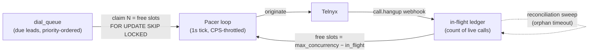

# Concurrency, Pacing & Queue Backpressure

Fills the gap Pier called out 2026-07-29 ("your docs didn't reference that concurrency is a
thing and we can buy more of it… there's going to be a queuing thing we need to build").
Sean, 2026-07-31. ➤ direction — numbers harden when T2 keys land and we read our actual
Telnyx account limits.

## Requirements (from the 7/29 sync, made explicit)

1. Telnyx concurrency is capped and **purchasable** — the build must expose the cap as config,
   not bake it in.
2. The backend is built **from day one** to scale dials up/down and to run at max concurrency
   when asked — supporting 20M+ calls/mo is a hard requirement ("if it can't, we're not
   building it right").
3. When we're at max concurrency with calls ready, there is a **queue that drains sensibly** —
   not "pinging them every millisecond."
4. Hitting the cap must be **visible in stats** (Pier: "we'll feel it") — as an explicit KPI,
   not a mystery slowdown.

## The two Telnyx limits (confirm actual defaults under T2)

| Limit | What it bounds | Scaling lever |
|---|---|---|
| **Concurrent channels** | Calls in flight at once (ringing + talking + bridging) | Account setting / purchasable increase |
| **CPS (calls per second)** | Dial *initiation* rate | Separate account limit; matters for burst starts (e.g. 9am open) |

Both live in one config row (`pacing_config`: `max_concurrency`, `max_cps`, per-program caps)
so raising them is an UPDATE, not a deploy.

## Sizing math (why concurrency is THE throughput knob)

A dial occupies a channel for its full slot: ringing (~20–25s on no-answers, the majority) or
talk time (60–180s on connects). With average slot time `S` seconds and concurrency `C`:

```
dials/hour ≈ C × 3600 / S
```

| Avg slot | C=50 | C=200 | C=1,000 | C=2,000 |
|---|---|---|---|---|
| 30s | 6k/hr · 60k/10h-day | 24k/hr · 240k/day | 120k/hr · 1.2M/day | 240k/hr · 2.4M/day |
| 45s | 4k/hr · 40k/day | 16k/hr · 160k/day | 80k/hr · 800k/day | 160k/hr · 1.6M/day |

So: pilot volumes (tens of thousands/day) need concurrency in the **low hundreds**; matching
the human floors' ~2M dials/day needs **~1,500–2,000 channels** — a purchasing conversation,
not an architecture change. AMD answering-machine hangups shorten S and buy throughput back.

## Design: slot ledger + event-driven pacer (no polling)



- **In-flight ledger:** we track our own live-call count in Supabase (increment on originate,
  decrement on `call.hangup` webhook). We never ask Telnyx "are you full?" — the answer is
  local. This is the direct answer to Pier's every-millisecond worry: **slot release is
  event-driven** (webhooks), and the pacer's 1s tick is only the claim heartbeat.
- **Claiming:** pacer computes `free = max_concurrency − in_flight`, claims that many due rows
  with `FOR UPDATE SKIP LOCKED` (safe under multiple workers — horizontal scaling is adding
  pacer workers, nothing else), originates at ≤ `max_cps`.
- **At the cap, nothing is lost:** un-claimed rows simply stay due. Queue order =
  (program priority, cadence due-time, LIFO fresh / FIFO revive). Backpressure is a *state*,
  not an error.
- **Reconciliation sweep:** a periodic job expires ledger entries with no hangup event after
  `max_call_duration + grace` — webhook loss can't leak slots permanently.
- **Failed originates** return their slot immediately and follow the retry ladder (with
  jitter) already specified for the dial queue.

## The "we'll feel it" dashboard — make the cap visible

| KPI | Meaning | Action signal |
|---|---|---|
| **Slot utilization %** (in_flight / max_concurrency, by minute) | How hard we're driving the cap | Sustained ≥ ~90% during dial windows → buy concurrency |
| **Queue depth + oldest-due age** | How much work is waiting and how stale | Growing during windows → capacity problem, not lead-supply problem |
| **CPS throttle events** | Burst starts hitting the initiation limit | Raise CPS or smooth the open-of-day ramp |
| **Cadence misses** | Leads dialed materially later than their scheduled slot | The cost of under-capacity, in revenue terms |

These come free from the ledger + queue tables — no extra instrumentation.

## Interactions with the rest of the system

- **"Dialing paused" (open scope question) gets a precise meaning:** the pacer stops claiming;
  in-flight calls finish and transfer normally; the queue holds. Kill switches (global /
  per-program / per-client) are just claim-filters on the same loop.
- **Per-program caps:** each program can hold a concurrency share so one tenant's burst can't
  starve another (multi-tenant fairness).
- **DID rotation is queue-side and intraday-native:** at originate time the pacer picks the
  least-used eligible DID (area-code match, under daily cap) — spreading load across the pool
  is a `min()` lookup, not machinery. Long-term retirement stays a nightly Snowflake directive
  (see `snowflake-value.md` row 1).
- **Transfer-capacity guard:** don't originate more qualified-lead volume than transfer buyers
  can answer — a per-client active-transfer counter joins the claim filter (the abandon-rate
  analog for an AI floor).

## Open items

- ❓ T2: read our actual Telnyx default channel + CPS limits and the price schedule for raising
  them (feeds W5 cost outline).
- ❓ Average slot time S by vertical/list-age — **replica data can't answer this**
  (`vicidial_log.length_in_sec` excludes ring time; see `../reporting/td-windows-did-study.md`
  §6.5) → measure S in the Telnyx PoC (T2). Replica gives shape only: 7:00–16:00 MST dialing,
  2× front-load at open, ~8–9s answered talk time on TD's soundboard floor.
- ❓ Whether Telnyx enforces per-DID origination limits separate from account CPS.
