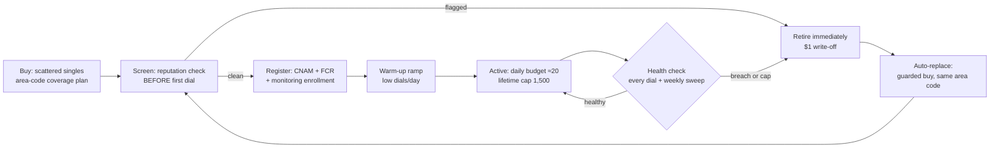

# DID Lifecycle — Acquisition → Registration → Health → Loop

Draft v1, Sean 2026-08-17 (➤ direction; individual policies marked below). Prompted by
standing up the first production dial pool: every program's results are only as good as the
numbers we dial from, and our single test DID was spam-tagged from its first dial. This doc
turns the accumulated empirical work into an operating design.

**Evidence base** (all in the workspace repo `C:\Claude\fivestrata\docs\reporting\`):
`td-windows-did-study.md` (7/31 — decay curve, TD rotation shape, default-CID lesson),
`kb-did-study.md` (8/5 — caps ≠ health, decline-rate burn signal, block-level flags),
`cidr-vendor-evaluation.md` (8/14 — remediation buys nothing; monitoring + provisioning
screening + rotation is what works; recycled numbers arrive pre-flagged). Telnyx surface:
`telnyx-capability-review.md` §4–6 (Number Reputation API, bulk order 10k/order, API delete,
$1/mo local, A-attestation).

## The one-paragraph recommendation

Run a **wide-shallow pool with hard budgets and individual retirement**: buy scattered
singles across area codes (never contiguous blocks), screen every number's reputation
**before its first dial**, register it (CNAM + Free Caller Registry + reputation
monitoring) during a **warm-up ramp**, watch two signals per DID from our own fact stream
(carrier-decline rate and answer rate vs cohort), and retire **individually** on breach or
at the 1,500-lifetime cap with a guarded auto-replacement buy in the same area code. Do
**not** buy remediation — the CIDR evaluation showed it restores nothing; rotation does.



## 1. What to buy

| Policy | Value | Why (provenance) |
|---|---|---|
| Shape | **Scattered singles across NPA-NXX prefixes**, never contiguous blocks | Burn is block-level: KB's 582-295-2xxx / 732-327-2xxx blocks flagged together; TD's big purchased blocks burned as units (7/31, 8/5 studies) |
| Geography | Area-code coverage matched to lead geography, plus a **reserve pool as the no-match fallback** | TD's single default CID took 173K dials in 90 days and is permanently burned — the fallback must be a pool, one config line for us (7/31 study §1) |
| Count | **dials/day ÷ ~20** target intensity, floor of coverage + reserve; start 50–100 per the roadmap default | TD decay curve: answered% 30.2 → 21.4 → 18.9 across 1–10 / 11–25 / 26–50 dials/DID/day — the knee is ~10–25 (7/31 §3). Roadmap open-item default: 50–100 with a backup group |
| Capabilities | Voice; **+SMS flag ($0.10/mo) on a designated sub-pool** | SMS follow-up is a plausible future lane for several programs; cheap option now vs re-buying later |
| Price guardrails | Per-order $ cap + per-week count cap, same pattern as `scripts/did-purchase.ts` (cheapest candidates, hard abort over budget, never prints keys) | Existing approved guardrail style (8/7) |

**Provisioning-time screening is the earliest-leverage step** (CIDR finding 4: 2,957
recycled numbers were flagged the same day they were added; the never-dialed stratum opened
at 16.4% refused). Buy → same-day Telnyx **Number Reputation API** query → any number that
arrives labeled is retired before its first dial (a $1 write-off, vs poisoning a campaign —
our own test DID was spam-labeled from its first dial, matching the recycled-number
pattern). ✅ RESOLVED (D1 probe, 8/17): the API only accepts numbers **on-account and
in-service** — pre-purchase screening is impossible; buy→screen→retire IS the design.

## 2. Registration (all before first dial, during warm-up)

1. **CNAM** — `scripts/did-cnam.ts` exists (`FIVESTRATA`). ❓ Per-tenant CNAM: should a
   tenant program's DIDs display that tenant's brand instead? (Whole-call branding is why
   pre-auth-at-dial exists; CNAM is the same question one layer down.)
2. **Free Caller Registry** — covers the three analytics networks behind the big carriers
   (First Orion/T-Mobile, TNS/Verizon, Hiya/AT&T). Today a manual Sean web form (pending
   for the test DID); at pool scale this becomes a batch step per acquisition wave.
   ❓ Whether FCR accepts bulk CSV registration or per-number forms only.
3. **Reputation monitoring enrollment** — Telnyx Number Reputation API scheduled re-checks
   (billable per query — sample the pool weekly, census only on suspicion). CIDR remains
   Ashley's vendor; their *monitoring* proved accurate (8/14 eval) even though remediation
   didn't — if a CIDR contract survives the 8/17 renegotiation, it can be the second eye.
4. **SHAKEN/STIR A-attestation** — automatic while numbers live on Telnyx and calls
   originate there (capability review §6). A standing reason not to BYO-carrier the pool.
5. **Warm-up ramp** — new DIDs run at reduced daily budget before full duty. ➤ Start
   conservative (~5/day for the first week, then 20); the platform's test-bench nature
   makes ramp length itself a testable variable.

## 3. Health monitoring — two eyes, ours is primary

**Internal (per dial, real time, free):** we own every dial in `calls`/`call_events` —
unlike the human floors, whose replicas are T-1. Per-DID rolling views (Brandon's 7/22 ask):

| Signal | Threshold (initial, tunable) | Provenance |
|---|---|---|
| Carrier-decline rate (SIP 603/403-equivalent hangup causes) | >5% over trailing 300 dials = warning; >10% = quarantine | TD healthy baseline ≈1.5%; KB burned floors run 10–25% (8/5 §3) |
| Answer rate vs pool cohort (same vertical, same daypart) | < half of cohort median = quarantine | TD decay curve; cohort-relative avoids blaming the DID for a bad list |
| Dials/day | hard budget ~20–25 | the decay knee (7/31 §3) |
| Lifetime dials | **1,500 auto-retire** — already `dids.max_dials` in schema | July-16 DID Health Review action 1; no vendor ever implemented it (8/5 §1 correction) — our native differentiator |
| Carrier voicemail-diversion pattern | consecutive instant-voicemail on a carrier | hypothesized only — an earlier "observed on the test DID" readout was a misread (the callee simply wasn't answering; corrected by Sean 8/17). Validate before wiring as a trigger |

**External (scheduled, billable):** weekly reputation-API sample of the active pool;
full sweep on any program-level contact-rate drop. Labels diverge by carrier (CIDR: Verizon
59%, T-Mobile 96% labeled on the same pool) — store per-source flags, not one boolean.

**States:** extend `dids.status` (0001 has active/cooling/retired) to the full lifecycle:
`screening → warming → active → resting → quarantined → retired`. "Resting" is a
**free option bounded by the billing month, never a remedy** (➤ Sean 8/17): the
replacement is bought at quarantine time regardless (the pool stays at size), and Telnyx
commits the 30-day price at purchase — so a quarantined DID rests through its already-paid
month at $0 marginal cost, gets re-screened (cached query, free) just before renewal, and
either returns to warming or is released before the next dollar. Rest past a renewal
boundary is pure rent and is not a state the sweep permits. CIDR showed list-flags churn
(2,036 cleared, 1,555 re-flagged) and no measurable remediation effect, so expect the
policy to resolve to retire-at-renewal in practice — anything recovered is upside.

### Draft migration 0008 (not applied — schema TODO)

```sql
alter table dids
  add column npa_nxx            text generated always as (substring(phone_number from 3 for 6)) stored,
  add column daily_budget       integer not null default 20,
  add column warmup_until       timestamptz,
  add column acquisition_batch  text,
  add column screened_at        timestamptz,
  add column registered_cnam    boolean not null default false,
  add column registered_fcr     boolean not null default false,
  add column sms_capable        boolean not null default false,
  add column reputation_flags   jsonb not null default '{}'::jsonb,  -- per-source labels
  add column reputation_checked_at timestamptz,
  add column tenant_id          uuid references tenants (id);        -- pool affinity (❓ shared vs per-tenant pools)
-- widen the status check to the six lifecycle states; per-DID daily spend view over calls
```

## 4. The acquisition loop

Retirement fires individually (benchmark breach or lifetime cap) → a guarded replacement
buy in the same area code → screening → registration → warm-up → active. The loop is the
product: the 7/22 call named per-DID retirement-by-benchmark as exactly the lever carriers
won't give the human floors (they rotate whole blocks, some still good).

**Economics.** At a fixed retirement threshold, consumption depends only on dial volume,
not pool size (CIDR §Economics): volume ÷ 1,500 = numbers/month. A small first program at,
say, 2K dials/day ≈ 40 numbers/mo ≈ **$40–80/mo** — noise. The CV pilot at 100K/day ≈ 2K/mo ≈
$2–4K/mo — still small against what rotation buys (CIDR measured ~+20–25% contacts/mo and
~6M dead paid dials/mo removed at KB scale). Budget caps live in config, enforcement in the
buy script, so a runaway loop can never spend past its weekly allowance.

**What we deliberately do NOT build:** remediation automation. The 8/14 CIDR evaluation
(matched panel, 2,950 enrolled, adversarially verified) found no measurable performance
effect from monitoring+remediation; every wear stratum reached 13–25% refusal within six
weeks regardless. Retire-and-replace is cheaper and measurably works.

## The hitlist (D1–D16)

The tracked work surface for the DID workflow (house style: C1–C7, T1–T11). Three gates:
**Gate 1** = a clean screened pool dialing for the first live program. **Gate 2** = the loop
runs itself (budgets enforced, retirement + replacement automated). **Gate 3** =
optimization experiments live. Ordered by dependency within each gate.

### Gate 1 — clean pool for the first live program (the pressing case)

| # | Item | What / acceptance | Owner | Cost |
|---|---|---|---|---|
| D1 | **Reputation-API recon** | ✅ DONE 8/17 (`scripts/did-reputation-probe.ts`, read-only). Findings: (a) numbers must be **on-account + in-service** → no pre-purchase screening, buy→screen→retire confirmed; (b) enablement is one-time: ToS agree → create enterprise → **signed LOA** → Hiya vetting ~minutes (Sean's clicks — added to D8d); (c) pricing: **$100/mo per enterprise base fee** + billed `fresh=true` queries (rate TBD from portal); **cached queries free** — at first-pool scale the base fee dominates all other DID costs combined (decision point in D8d); (d) vetting + risk scores are **Hiya-centric** (`spam_risk`/`spam_category` + maturity/connection/engagement/sentiment 0–100) — verify multi-source coverage once live; (e) side-probe: `/number_lookup` returns 403 on our key — separate product, could be a cheap pre-buy carrier/line-type layer if enabled (❓ optional) | Claude ✅ | pennies |
| D2 | **Decline-signal mapping** | ✅ MACHINERY DONE 8/17 (`scripts/did-decline-audit.ts`): pages all `call.hangup` events, tallies hangup_cause × SIP × source, per-DID decline rate (masked last-4). Bucket: `call_rejected` + `unspecified` = DECLINE; `not_found`/`unallocated_number`/`invalid_number_format` count against the **list**, not the DID. Current data (4,107 hangups) is all `normal_clearing` — the persona rig stays on-net at Telnyx and never crosses a carrier analytics gate, so **0 declines observed is expected, not evidence**. Calibration (incl. whether `unspecified` belongs in the bucket) waits for real off-net outbound | Claude ✅ (calibration pending real traffic) | $0 |
| D3 | **Pool-purchase script** | Extend `did-purchase.ts`: N scattered singles (enforce ≤1 per NPA-NXX per batch), area-code plan as input, per-order $ cap + per-week count cap, writes `dids` rows with `acquisition_batch`. Same guardrail style as the 8/7 approval | Claude builds; **Sean approves spend** | ~$1/DID upfront |
| D4 | **Screening step** | Same-day reputation check on every new number BEFORE first dial; flagged → auto-retire (write-off). **Built screening-ready, degrades gracefully** (➤ Sean 8/17): while the service is deferred (D8d), numbers pass through marked `unscreened`; on enablement day the whole live pool is **retro-screened** (the API works on owned in-service numbers) and flagged DIDs retire then | Claude | per-query price × pool, deferred |
| D5 | **Migration 0008** | Apply the draft (six lifecycle states, `daily_budget`, `warmup_until`, `npa_nxx`, `reputation_flags` jsonb, batch id, tenant affinity) + per-DID health view over `calls` | Claude (`db-apply.ts`) | $0 |
| D6 | **Registration batch** | CNAM per batch (extend `did-cnam.ts`); FCR — investigate bulk path, else generate a paste-ready batch file for Sean's web-form session; record `registered_*` flags | Claude + Sean (FCR form) | $0 (FCR free; ❓ CNAM storage fee — verify in D1 recon) |
| D7 | **First pool live** | 10–25 screened, registered, warming DIDs sized to the first program's lead geography (waits on that program's lead list for the area-code plan; buy the reserve pool immediately, coverage tail after) | Claude + Sean | ~$10–25 up + same /mo |
| D8 | **Decisions/actions needed from Sean** | (a) initial pool size + monthly DID budget cap; (b) per-tenant CNAM — display the tenant's brand on its programs' DIDs? (c) SMS-capable sub-pool now (+$0.10/mo each) or later; (d) **Number Reputation enablement — ➤ DEFERRED (Sean 8/17): build all flows screening-ready, enable later.** Interim: D2 decline-monitoring catches bad DIDs during warm-up (days at pilot volume); D11 sweeps wait. Enable trigger: monthly churn × ~20% bad-buy rate > $100/mo, or a client conversation needs the keep-rate live. Activation is a ~10-min event: fill `C:\Claude\aicc-enterprise.json`, sign the LOA, run `scripts/did-reputation-enable.ts --i-approve-tos-and-fee` (ToS + enterprise + LOA + enable + vet-poll + associate, idempotent), then retro-screen the pool (D4). Fee hits the existing prepaid Telnyx balance — auto-recharge becomes mandatory at enablement (negative balance bricks AI inference account-wide) | Sean (timing) | **$100/mo once enabled** + fresh queries |

### Gate 2 — the loop runs itself

| # | Item | What / acceptance | Owner | Cost |
|---|---|---|---|---|
| D9 | **Dial-path budget enforcement** | Queue engine DID selection reads status/`daily_budget`/`warmup_until`/`dial_count`: round-robin across eligible pool, area-code match with **pool** fallback (the TD default-CID lesson), hard stop at lifetime cap. Acceptance: a battery shows even spread + no DID over budget | Claude | $0 |
| D10 | **Retirement sweep** | Cron: evaluate D2 thresholds (decline >5% warn / >10% quarantine over trailing 300; cohort answer-rate < half median) → state transitions + guarded replacement buy (at quarantine, not retirement — the pool never shrinks) → re-enters D4 pipeline; quarantined DIDs rest to their renewal boundary, cached re-screen, recover-or-release (§3 rest policy). Alert on every transition with reason | Claude | replacement ~$1/DID |
| D11 | **Scheduled reputation sweep** | Weekly sample of active pool (size vs D1 price), census on program-level contact-rate drop; per-source flags into `reputation_flags` | Claude | D1 price × sample |
| D12 | **Console DID screen** | Buy/retire (guarded) + the health view; already in W8 scope — wire to D5's view, phones masked last-4 | Claude | $0 |

### Gate 3 — optimization experiments (the platform's test-bench nature applied to DIDs)

| # | Item | What | Cost |
|---|---|---|---|
| D13 | Warm-up ramp length A/B (start ~5/day wk 1 → 20; vs straight-to-20) | contact-rate + decline-rate delta by cohort | dial time only |
| D14 | Rest-and-recover — RESHAPED (Sean 8/17) from a paid trial into a **free standing policy**: quarantined DIDs rest through their already-paid billing month, cached re-screen before renewal, recover-or-release at the boundary (never rest across a renewal — the replacement was bought at quarantine anyway, so cross-boundary rest is pure rent). The "experiment" is just logging the recovery rate the policy observes for free | $0 |
| D15 | Daily-budget knee refinement — re-derive the TD 10–25/day curve on OUR pool from our own fact stream | $0 |
| D16 | CIDR-as-second-eye — if Ashley's contract survives the 8/17 renegotiation, compare its flags vs Telnyx reputation API on the same pool | contract-dependent (Ashley) |

**Affordability envelope:** first pool ≈ **$25 up-front + $25–30/mo**; CV-pilot scale
(100K dials/day) ≈ 2K numbers/mo ≈ **$2–4K/mo** — vs the ~+20–25% contacts/mo rotation
bought at KB scale. The only unpriced line is reputation queries (D1). Everything spendable
sits behind an explicit cap (D3/D8a/D10) so nothing can run away.
