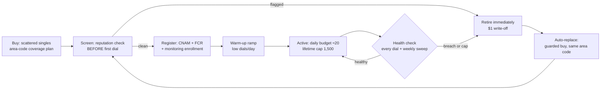

# DID Lifecycle — Acquisition → Registration → Health → Loop

Draft v1, Sean 2026-08-17 (➤ direction; individual policies marked below). Prompted by the
AutoWeb phase-1 greenlight: survey results are only as good as the numbers we dial from, and
our single test DID was spam-tagged from its first dial. This doc turns the accumulated
empirical work into an operating design.

**Evidence base** (all in the workspace repo `C:\Claude\fivestrata\docs\reporting\`):
`td-windows-did-study.md` (7/31 — decay curve, TD rotation shape, default-CID lesson),
`kb-did-study.md` (8/5 — caps ≠ health, decline-rate burn signal, block-level flags),
`cidr-vendor-evaluation.md` (8/14 — remediation buys nothing; monitoring + provisioning
screening + rotation is what works; recycled numbers arrive pre-flagged). Telnyx surface:
`telnyx-capability-review.md` §4–6 (Number Reputation API, bulk order 10k/order, API delete,
$1/mo local, A-attestation).

## The one-paragraph recommendation

Run a **wide-shallow pool with hard budgets and individual retirement**: buy scattered
singles across area codes (never contiguous blocks), screen every number's reputation
**before its first dial**, register it (CNAM + Free Caller Registry + reputation
monitoring) during a **warm-up ramp**, watch two signals per DID from our own fact stream
(carrier-decline rate and answer rate vs cohort), and retire **individually** on breach or
at the 1,500-lifetime cap with a guarded auto-replacement buy in the same area code. Do
**not** buy remediation — the CIDR evaluation showed it restores nothing; rotation does.



## 1. What to buy

| Policy | Value | Why (provenance) |
|---|---|---|
| Shape | **Scattered singles across NPA-NXX prefixes**, never contiguous blocks | Burn is block-level: KB's 582-295-2xxx / 732-327-2xxx blocks flagged together; TD's big purchased blocks burned as units (7/31, 8/5 studies) |
| Geography | Area-code coverage matched to lead geography, plus a **reserve pool as the no-match fallback** | TD's single default CID took 173K dials in 90 days and is permanently burned — the fallback must be a pool, one config line for us (7/31 study §1) |
| Count | **dials/day ÷ ~20** target intensity, floor of coverage + reserve; start 50–100 per the roadmap default | TD decay curve: answered% 30.2 → 21.4 → 18.9 across 1–10 / 11–25 / 26–50 dials/DID/day — the knee is ~10–25 (7/31 §3). Roadmap open-item default: 50–100 with a backup group |
| Capabilities | Voice; **+SMS flag ($0.10/mo) on a designated sub-pool** | AutoWeb stage 4 floated SMS; cheap option now vs re-buying later |
| Price guardrails | Per-order $ cap + per-week count cap, same pattern as `scripts/did-purchase.ts` (cheapest candidates, hard abort over budget, never prints keys) | Existing approved guardrail style (8/7) |

**Provisioning-time screening is the earliest-leverage step** (CIDR finding 4: 2,957
recycled numbers were flagged the same day they were added; the never-dialed stratum opened
at 16.4% refused). Buy → same-day Telnyx **Number Reputation API** query → any number that
arrives labeled is retired before its first dial (a $1 write-off, vs poisoning a campaign —
our own test DID was spam-labeled from its first dial, matching the recycled-number
pattern). ❓ Verify whether the reputation API can query candidates *pre-purchase*; if yes,
screen moves before the buy.

## 2. Registration (all before first dial, during warm-up)

1. **CNAM** — `scripts/did-cnam.ts` exists (`FIVESTRATA`). ❓ Per-tenant CNAM: should
   AutoWeb-program DIDs display an AutoWeb brand instead? (Whole-call branding is why
   pre-auth-at-dial exists; CNAM is the same question one layer down.)
2. **Free Caller Registry** — covers the three analytics networks behind the big carriers
   (First Orion/T-Mobile, TNS/Verizon, Hiya/AT&T). Today a manual Sean web form (pending
   for the test DID); at pool scale this becomes a batch step per acquisition wave.
   ❓ Whether FCR accepts bulk CSV registration or per-number forms only.
3. **Reputation monitoring enrollment** — Telnyx Number Reputation API scheduled re-checks
   (billable per query — sample the pool weekly, census only on suspicion). CIDR remains
   Ashley's vendor; their *monitoring* proved accurate (8/14 eval) even though remediation
   didn't — if a CIDR contract survives the 8/17 renegotiation, it can be the second eye.
4. **SHAKEN/STIR A-attestation** — automatic while numbers live on Telnyx and calls
   originate there (capability review §6). A standing reason not to BYO-carrier the pool.
5. **Warm-up ramp** — new DIDs run at reduced daily budget before full duty. ➤ Start
   conservative (~5/day for the first week, then 20); the platform's test-bench nature
   makes ramp length itself a testable variable.

## 3. Health monitoring — two eyes, ours is primary

**Internal (per dial, real time, free):** we own every dial in `calls`/`call_events` —
unlike the human floors, whose replicas are T-1. Per-DID rolling views (Brandon's 7/22 ask):

| Signal | Threshold (initial, tunable) | Provenance |
|---|---|---|
| Carrier-decline rate (SIP 603/403-equivalent hangup causes) | >5% over trailing 300 dials = warning; >10% = quarantine | TD healthy baseline ≈1.5%; KB burned floors run 10–25% (8/5 §3) |
| Answer rate vs pool cohort (same vertical, same daypart) | < half of cohort median = quarantine | TD decay curve; cohort-relative avoids blaming the DID for a bad list |
| Dials/day | hard budget ~20–25 | the decay knee (7/31 §3) |
| Lifetime dials | **1,500 auto-retire** — already `dids.max_dials` in schema | July-16 DID Health Review action 1; no vendor ever implemented it (8/5 §1 correction) — our native differentiator |
| Carrier voicemail-diversion pattern | consecutive instant-voicemail on a carrier | hypothesized only — an earlier "observed on the test DID" readout was a misread (the callee simply wasn't answering; corrected by Sean 8/17). Validate before wiring as a trigger |

**External (scheduled, billable):** weekly reputation-API sample of the active pool;
full sweep on any program-level contact-rate drop. Labels diverge by carrier (CIDR: Verizon
59%, T-Mobile 96% labeled on the same pool) — store per-source flags, not one boolean.

**States:** extend `dids.status` (0001 has active/cooling/retired) to the full lifecycle:
`screening → warming → active → resting → quarantined → retired`. "Resting" is an
experiment arm, not a remedy — CIDR showed list-flags churn (2,036 cleared, 1,555
re-flagged) and no measurable remediation effect; default path from quarantine is retire.
Rest-and-recover is testable later, cheaply.

### Draft migration 0008 (not applied — schema TODO)

```sql
alter table dids
  add column npa_nxx            text generated always as (substring(phone_number from 3 for 6)) stored,
  add column daily_budget       integer not null default 20,
  add column warmup_until       timestamptz,
  add column acquisition_batch  text,
  add column screened_at        timestamptz,
  add column registered_cnam    boolean not null default false,
  add column registered_fcr     boolean not null default false,
  add column sms_capable        boolean not null default false,
  add column reputation_flags   jsonb not null default '{}'::jsonb,  -- per-source labels
  add column reputation_checked_at timestamptz,
  add column tenant_id          uuid references tenants (id);        -- pool affinity (❓ shared vs per-tenant pools)
-- widen the status check to the six lifecycle states; per-DID daily spend view over calls
```

## 4. The acquisition loop

Retirement fires individually (benchmark breach or lifetime cap) → a guarded replacement
buy in the same area code → screening → registration → warm-up → active. The loop is the
product: the 7/22 call named per-DID retirement-by-benchmark as exactly the lever carriers
won't give the human floors (they rotate whole blocks, some still good).

**Economics.** At a fixed retirement threshold, consumption depends only on dial volume,
not pool size (CIDR §Economics): volume ÷ 1,500 = numbers/month. AutoWeb phase 1 at, say,
2K dials/day ≈ 40 numbers/mo ≈ **$40–80/mo** — noise. The CV pilot at 100K/day ≈ 2K/mo ≈
$2–4K/mo — still small against what rotation buys (CIDR measured ~+20–25% contacts/mo and
~6M dead paid dials/mo removed at KB scale). Budget caps live in config, enforcement in the
buy script, so a runaway loop can never spend past its weekly allowance.

**What we deliberately do NOT build:** remediation automation. The 8/14 CIDR evaluation
(matched panel, 2,950 enrolled, adversarially verified) found no measurable performance
effect from monitoring+remediation; every wear stratum reached 13–25% refusal within six
weeks regardless. Retire-and-replace is cheaper and measurably works.

## Build order (smallest useful first)

1. **Screen + register the AutoWeb pool** (~10–25 DIDs for phase 1): extend
   `did-purchase.ts` to N scattered singles with the screening step; run CNAM + FCR.
   This unblocks AutoWeb phase 1 with clean numbers — the pressing case.
2. **Migration 0008** + per-DID health view over `calls`.
3. **Budget enforcement in the dial path** (queue engine reads `daily_budget`,
   `dial_count`, status).
4. **Retirement sweep + guarded auto-replacement** (cron: evaluate thresholds, retire,
   buy, re-enter pipeline).
5. Console DID screen (buy/retire already in W8 scope) reads the same views.

## Open questions

❓ Reputation API pre-purchase screening (above) · ❓ per-tenant CNAM/pools · ❓ FCR bulk
registration · ❓ warm-up ramp length (test) · ❓ rest-and-recover viability (test) ·
❓ CIDR contract survival post-8/17 meeting (Ashley) — affects whether we get a second
monitoring eye for free · ❓ exact Telnyx hangup-cause taxonomy mapping to "carrier decline"
(verify against live call_events before setting thresholds).
