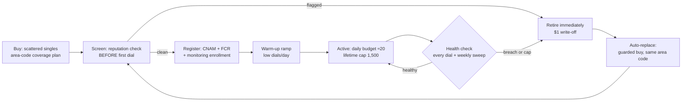

# DID Lifecycle — Acquisition → Registration → Health → Loop

Draft v1, Sean 2026-08-17 (➤ direction; individual policies marked below). Prompted by
standing up the first production dial pool: every program's results are only as good as the
numbers we dial from, and our single test DID was spam-tagged from its first dial. This doc
turns the accumulated empirical work into an operating design.

**Evidence base** (all in the workspace repo `C:\Claude\fivestrata\docs\reporting\`):
`td-windows-did-study.md` (7/31 — decay curve, TD rotation shape, default-CID lesson),
`kb-did-study.md` (8/5 — caps ≠ health, decline-rate burn signal, block-level flags),
`cidr-vendor-evaluation.md` (8/14 — remediation buys nothing; monitoring + provisioning
screening + rotation is what works; recycled numbers arrive pre-flagged). Telnyx surface:
`telnyx-capability-review.md` §4–6 (Number Reputation API, bulk order 10k/order, API delete,
$1/mo local, A-attestation).

## The one-paragraph recommendation

Run a **wide-shallow pool with hard budgets and individual retirement**: buy scattered
singles across area codes (never contiguous blocks), screen every number's reputation
**before its first dial**, register it (CNAM + Free Caller Registry + reputation
monitoring) during a **warm-up ramp**, watch two signals per DID from our own fact stream
(carrier-decline rate and answer rate vs cohort), and retire **individually** on breach or
at the 1,500-lifetime cap with a guarded auto-replacement buy in the same area code. Do
**not** buy remediation — the CIDR evaluation showed it restores nothing; rotation does.

## 1. What to buy

| Policy | Value | Why (provenance) |
|---|---|---|
| Shape | **Scattered singles across NPA-NXX prefixes**, never contiguous blocks | Burn is block-level: KB's 582-295-2xxx / 732-327-2xxx blocks flagged together; TD's big purchased blocks burned as units (7/31, 8/5 studies) |
| Geography | Area-code coverage matched to lead geography, plus a **reserve pool as the no-match fallback** | TD's single default CID took 173K dials in 90 days and is permanently burned — the fallback must be a pool, one config line for us (7/31 study §1) |
| Count | **dials/day ÷ ~20** target intensity, floor of coverage + reserve; start 50–100 per the roadmap default | TD decay curve: answered% 30.2 → 21.4 → 18.9 across 1–10 / 11–25 / 26–50 dials/DID/day — the knee is ~10–25 (7/31 §3). Roadmap open-item default: 50–100 with a backup group |
| Capabilities | Voice; **+SMS flag ($0.10/mo) on a designated sub-pool** | SMS follow-up is a plausible future lane for several programs; cheap option now vs re-buying later |
| Price guardrails | Per-order $ cap + per-week count cap, same pattern as `scripts/did-purchase.ts` (cheapest candidates, hard abort over budget, never prints keys) | Existing approved guardrail style (8/7) |

**Provisioning-time screening is the earliest-leverage step** (CIDR finding 4: 2,957
recycled numbers were flagged the same day they were added; the never-dialed stratum opened
at 16.4% refused). Buy → same-day Telnyx **Number Reputation API** query → any number that
arrives labeled is retired before its first dial (a $1 write-off, vs poisoning a campaign —
our own test DID was spam-labeled from its first dial, matching the recycled-number
pattern). ✅ RESOLVED (D1 probe, 8/17): the API only accepts numbers **on-account and
in-service** — pre-purchase screening is impossible; buy→screen→retire IS the design.

## 2. Registration (all before first dial, during warm-up)

1. **CNAM** — `scripts/did-cnam.ts` exists (`FIVESTRATA`). ❓ Per-tenant CNAM: should a
   tenant program's DIDs display that tenant's brand instead? (Whole-call branding is why
   pre-auth-at-dial exists; CNAM is the same question one layer down.)
   **❓ Display-name decision opened at the 8/18 shareout** (see
   `meetings/2026-08-18-shareout.md`): `FIVESTRATA` rendered as **"Five Strata" on
   Verizon during the demo** (carrier-dependent), but Five Strata is **not a legal
   entity** — the DBA is **"New Strata"** (confirm before STIR/SHAKEN-adjacent
   registration). **Contractors.com proposed** as the display name (strong home-services
   branding fit); hard constraint: the displayed name **must match the partner list on
   the lead forms** before any change goes live.
2. **Free Caller Registry** — covers the three analytics networks behind the big carriers
   (First Orion/T-Mobile, TNS/Verizon, Hiya/AT&T). Today a manual Sean web form (pending
   for the test DID); at pool scale this becomes a batch step per acquisition wave.
   ❓ Whether FCR accepts bulk CSV registration or per-number forms only.
3. **Reputation monitoring enrollment** — Telnyx Number Reputation API scheduled re-checks
   (billable per query — sample the pool weekly, census only on suspicion). CIDR remains
   Ashley's vendor; their *monitoring* proved accurate (8/14 eval) even though remediation
   didn't — if a CIDR contract survives the 8/17 renegotiation, it can be the second eye.
4. **SHAKEN/STIR A-attestation** — automatic while numbers live on Telnyx and calls
   originate there (capability review §6). A standing reason not to BYO-carrier the pool.
5. **Warm-up ramp** — new DIDs run at reduced daily budget before full duty. ➤ Start
   conservative (~5/day for the first week, then 20); the platform's test-bench nature
   makes ramp length itself a testable variable.
6. **Inbound callback path** (✅ Sean 8/18: "no reason not to — potentially boosts
   scores, basically free" — hitlist D17). TNS's
   published best practices ([voicespamfeedback.com/vsf/bestPractices](https://voicespamfeedback.com/vsf/bestPractices),
   the Verizon-side analytics engine) require a "consistent, real, and **user-dialable**"
   calling number and a contact path for complaint/DNC reporting — a pool DID that rings
   dead on callback pattern-matches spam infrastructure.
   **v1 scope (✅ Sean 8/18): answer + DNC only — a basic mailbox.** Every pool DID
   answers with a minimal branded greeting whose ONLY offered action is removal from
   future calls (press-1 → `dnc_numbers`, the same table the inbound DNC API feeds;
   confirm and disconnect). The fuller menu was considered and cut: the only other
   legitimate option is **"request a consultation"** (a *queued callback* placed when a
   warm transfer is possible — NOT a live bridge), and that path is an
   exception-to-an-exception-to-an-exception — ~0 benefit for the build cost right now.
   It stays here as the acknowledged later shape if callback volume ever justifies it.
   One Telnyx Call Control app answering for the whole pool (webhook already exists);
   per-tenant greeting from `tenants.cnam`.
   **⚠ The greeting script is a legal artifact (✅ Sean 8/18): anyone can trivially
   record it, and plaintiff-side TCPA firms do — it must be airtight, double- and
   triple-checked before any live deployment**, versioned in the repo, and changed only
   through the same review. Framing for that review: this line can double as the
   FCC-required automated opt-out mechanism (47 CFR §64.1200(b)(3)) if we ever leave
   prerecorded voicemails, so draft to that standard from day one — identify the calling
   party by the legally correct name (inherits the open New Strata DBA /
   Contractors.com display-name decision; greeting and CNAM must land consistently),
   state the opt-out plainly, execute it immediately, zero marketing content.
   ❓ Who owns the legal review (Kinsey? outside counsel?).
   **Cost: airtime only** — no Telnyx per-DID inbound fee beyond the $1/mo already paid;
   inbound leg ≈ $0.002/min Call Control + ~$0.0035/min inbound termination ≈
   **$0.0055/min**, and a DNC mailbox call runs well under a minute. At plausible
   callback volume (a small fraction of dials), this is fractions of a dollar per day.
   ➤ Answer-scope default (Claude, overridable): answer on `warming`/`active`/`resting`
   DIDs (resting numbers were dialed from most recently and are paid through the month
   anyway); `quarantined` same as resting; `retired`/released numbers are gone from the
   account regardless.
   **🆕 Pier vamp on the decided scope (Teams, 8/19 — ➤ pending Sean):** Sean shared the
   8/18 D17 decision with Pier, who endorsed it and riffed further. Supporting detail he
   added from Verizon's best-practices material: carriers penalize numbers that have
   **inbound disabled** when flagged callers dial back — reinforcing the answer-inbound
   rationale (airtime ≈ free). His escalation: skip straight past the mailbox to a
   callback IVR — greeting ("Thanks for calling in
   to Contractors.com. If you are returning a call from us, press 1 and we will reach out
   to you as soon as we can"), line held ~30s more; press-1 on an ANI-matched in-campaign
   lead bumps that lead to "call immediately" in its campaign; unmatched callers go to a
   generic AI agent; automatic IVR when outside client hours. Assessment vs the decided v1:
   - The **in-campaign requeue half is far cheaper than the cut "request a consultation"
     design** — IVR keypress event → one `dial_jobs` next-attempt UPDATE, no new AI
     surface, no in-flight TTS change. The exception^3 cost argument that justified the
     cut does not apply to it; legitimate v1.1 fast-follow candidate.
   - The **unmatched-caller → generic-AI half IS the expensive exception^3 part**
     (a brand-new inbound conversation surface) — keep deferred.
   - **His sample greeting omits the removal option entirely** — removal is the legal
     backbone of D17 and the good-faith story. Any merged IVR keeps removal first-class
     (e.g. press 1 = remove, press 2 = callback); the merged script is still one legal
     artifact through the same gate; "Contractors.com" inherits the open display-name
     decision.
   - "Call immediately" must clamp to TCPA quiet hours + the campaign's calling windows
     (= next legal window), and ❓ should the callback originate from the same DID the
     lead just dialed (recognition argues yes — a narrow, principled exception to
     rotate-never-sticky, decide when this builds).
   - ❓ Whether a press-1 requeue consumes one of the lead's `max_attempts` (an inbound
     return call is express engagement; leaning no, but decide explicitly).

## 3. Health monitoring — two eyes, ours is primary

**Internal (per dial, real time, free):** we own every dial in `calls`/`call_events` —
unlike the human floors, whose replicas are T-1. Per-DID rolling views (Brandon's 7/22 ask):

| Signal | Threshold (initial, tunable) | Provenance |
|---|---|---|
| Carrier-decline rate (SIP 603/403-equivalent hangup causes) | >5% over trailing 300 dials = warning; >10% = quarantine | TD healthy baseline ≈1.5%; KB burned floors run 10–25% (8/5 §3) |
| Answer rate vs pool cohort (same vertical, same daypart) | < half of cohort median = quarantine | TD decay curve; cohort-relative avoids blaming the DID for a bad list |
| Dials/day | hard budget ~20–25 | the decay knee (7/31 §3) |
| Lifetime dials | **1,500 auto-retire** — already `dids.max_dials` in schema | July-16 DID Health Review action 1; no vendor ever implemented it (8/5 §1 correction) — our native differentiator |
| Carrier voicemail-diversion pattern | consecutive instant-voicemail on a carrier | hypothesized only — an earlier "observed on the test DID" readout was a misread (the callee simply wasn't answering; corrected by Sean 8/17). Validate before wiring as a trigger |

### Trigger statistics (➤ Sean's derivative question, 8/17)

Decline events are Bernoulli per dial, so at the 20/day budget a per-DID *derivative*
(d rate/dt) is underpowered: daily-bin SE ≈ 4.9% at p=5%, 7-day slope SE ≈ 0.9%/day —
a +1%/day burn is ~1σ, and a fast burn crosses the level threshold before its slope is
significant. Differencing amplifies noise; the trailing-window level IS the best
low-pass-filtered derivative at this n. The design therefore uses statistics matched to
the scale where each has power:

1. **Per-DID fast burn: CUSUM change-point on the raw dial stream** (optimal at low n) —
   per dial: decline adds log(p₁/p₀) ≈ +1.90, clean adds log((1−p₁)/(1−p₀)) ≈ −0.09
   (p₀=1.5% TD-healthy, p₁=10% burned), floor 0, fire at h≈3. Two declines ≤~21 clean
   dials apart trip it — detection within tens of dials, one accumulator per DID.
   **✅ LIVE 8/17 (migration 0009, Sean: "sooner than later"):** a Postgres trigger on
   `call_events` hangup inserts maintains `dids.cusum_score` and auto-quarantines at h
   (stamps `cusum_fired_at`; retired DIDs exempt; bad-number causes decay, per the D2
   bucket). Parameters tunable in `dialer_config` (`did_cusum_up/down/h`). DB-side by
   design: zero changes to telnyx-agent/webhook (parallel TTS work owns the agent), and
   the statistic runs regardless of which code path dials. Self-test verified:
   0 → 1.90 → 1.81 → 3.70 → quarantined (at h=3). Exposed in `did_health`.
   **➤ Posture (Sean 8/17): h set EXTREMELY LIBERAL at 38** (~20 near-consecutive
   declines to fire) — the score is a visible showpiece first, an enforcement gate
   later. Ratchet direction is deliberate: `call_events` retains every hangup, so the
   CUSUM replays offline at any candidate h over full history — observe what h=3/10/20
   *would have* fired on, then lower with evidence (one `dialer_config` edit, key
   `did_cusum_h`). The analytical operating point remains h≈3.
2. **Per-DID slow burn: trailing-300 level** (>5% warn / >10% quarantine; SE ≈1.7% at
   p=10%, n=300).
3. **Pool/cohort drift: the derivative lives HERE, well-powered** — at 500 dials/day
   pool-wide, daily-rate SE ≈1%, 7-day slope SE ≈0.2%/day → +0.5%/day systemic drift
   detectable inside a week. Response is investigate/slow-down (list quality, campaign,
   carrier policy), not retirement. Same cohort machinery powers D15's wear-curve
   re-derivation d(answer)/d(lifetime dials). **➤ TABLED (Sean 8/17): build as a
   Snowflake reporting/optimization item, not an operational trigger** — joins D15 in
   Gate 3 / the snowflake-value.md output list.

p₀/p₁/h calibrate on real off-net traffic (with D2's bucket) before D10 wires them.

**Upstream protection:** the cheapest health intervention is never placing the dial —
the L1 dead-number hygiene rule (`campaign-delivery.md` §3, ✅ Sean 8/18) excludes
N+-attempts/zero-answers phones at campaign compile, because TNS scores dead-number
dialing and poor completion rates against the *calling* number, not just the campaign.
**✅ One-strike tightening (Sean 8/19, SHIPPED same day):** a carrier-confirmed
nonexistence cause (`unallocated_number` / `not_found` / `invalid_number_format` — D2's
"against the list" bucket) is deterministic, so the phone is excluded after **one** such
result rather than waiting out N attempts — every repeat dial to a known-dead number is
pure reputation damage on the calling DID. Gates both enrollment and job creation in
`campaign-plan.ts`; migration 0011 partial index; smoke-verified (details in
`campaign-delivery.md` §3).

**External (scheduled, billable):** weekly reputation-API sample of the active pool;
full sweep on any program-level contact-rate drop. Labels diverge by carrier (CIDR: Verizon
59%, T-Mobile 96% labeled on the same pool) — store per-source flags, not one boolean.

**States:** extend `dids.status` (0001 has active/cooling/retired) to the full lifecycle:
`screening → warming → active → resting → quarantined → retired`. "Resting" is a
**free option bounded by the billing month, never a remedy** (➤ Sean 8/17): the
replacement is bought at quarantine time regardless (the pool stays at size), and Telnyx
commits the 30-day price at purchase — so a quarantined DID rests through its already-paid
month at $0 marginal cost, gets re-screened (cached query, free) just before renewal, and
either returns to warming or is released before the next dollar. Rest past a renewal
boundary is pure rent and is not a state the sweep permits. CIDR showed list-flags churn
(2,036 cleared, 1,555 re-flagged) and no measurable remediation effect, so expect the
policy to resolve to retire-at-renewal in practice — anything recovered is upside.

### Migration 0008 — ✅ APPLIED 8/17

The real DDL lives at `supabase/migrations/0008_did_lifecycle.sql` (applied via
`db-apply.ts`): the columns above plus `cnam`, `tenants.cnam` (per-tenant CNAM seeds),
the widened six-state check ('cooling' rows migrated to 'resting'), scatter/tenant
indexes, and the **`did_health` view** — per-DID hangup totals, 7-day/today dial counts,
decline counts + `decline_pct` (D2 bucket), bad-number counts.

**✅ DID pools are per-tenant, never shared (Sean 8/19).** This is the standing answer
to "why can't we all just share DIDs" — two independent reasons, either sufficient:

1. **Reputation (TNS items 3–4):** carrier analytics score **content↔number alignment** —
   one number carrying unrelated purposes raises spam risk, and a repurposed number
   should sit idle **≥45 days** before reassignment. That figure exceeds our
   billing-month rest boundary, so any cross-purpose reuse would be paid rent on top of
   reputation risk.
2. **Billing & attribution (Sean 8/19):** the platform's commercial posture is that
   tenants *want to rent this box* — and that requires clean per-tenant attribution of
   every dial, every DID cost, and every reputation outcome. Shared DIDs make all three
   murky: whose campaign burned the number, whose bill carries the replacement, whose
   contact rate did the label hit?

Consequences: **a DID never moves between tenants or programs — when a program ends,
its DIDs retire and the next program buys fresh** ($1/number makes this cheap by
design); every buy carries `tenant_id` (D3 already requires it); existing
`tenant_id is null` rows are transitional dev inventory, not a supported state — D9's
eligibility query drops the null-tenant fallback once the first real pool lands.
Per-**program** affinity within a tenant stays ➤ direction (the TNS content-alignment
argument favors it; revisit when one tenant runs dissimilar programs concurrently).

## 4. The acquisition loop

Retirement fires individually (benchmark breach or lifetime cap) → a guarded replacement
buy in the same area code → screening → registration → warm-up → active. The loop is the
product: the 7/22 call named per-DID retirement-by-benchmark as exactly the lever carriers
won't give the human floors (they rotate whole blocks, some still good).

**Economics.** At a fixed retirement threshold, consumption depends only on dial volume,
not pool size (CIDR §Economics): volume ÷ 1,500 = numbers/month. A small first program at,
say, 2K dials/day ≈ 40 numbers/mo ≈ **$40–80/mo** — noise. The CV pilot at 100K/day ≈ 2K/mo ≈
$2–4K/mo — still small against what rotation buys (CIDR measured ~+20–25% contacts/mo and
~6M dead paid dials/mo removed at KB scale). Budget caps live in config, enforcement in the
buy script, so a runaway loop can never spend past its weekly allowance.

**What we deliberately do NOT build:** remediation automation. The 8/14 CIDR evaluation
(matched panel, 2,950 enrolled, adversarially verified) found no measurable performance
effect from monitoring+remediation; every wear stratum reached 13–25% refusal within six
weeks regardless. Retire-and-replace is cheaper and measurably works. (The free carrier
dispute forms — voicespamfeedback.com etc. — are what remediation vendors file under the
hood, so the same null result covers them.)

## The hitlist (D1–D17)

The tracked work surface for the DID workflow (house style: C1–C7, T1–T11). Three gates:
**Gate 1** = a clean screened pool dialing for the first live program. **Gate 2** = the loop
runs itself (budgets enforced, retirement + replacement automated). **Gate 3** =
optimization experiments live. Ordered by dependency within each gate.

### Gate 1 — clean pool for the first live program (the pressing case)

| # | Item | What / acceptance | Owner | Cost |
|---|---|---|---|---|
| D1 | **Reputation-API recon** | ✅ DONE 8/17 (`scripts/did-reputation-probe.ts`, read-only). Findings: (a) numbers must be **on-account + in-service** → no pre-purchase screening, buy→screen→retire confirmed; (b) enablement is one-time: ToS agree → create enterprise → **signed LOA** → Hiya vetting ~minutes (Sean's clicks — added to D8d); (c) pricing: **$100/mo per enterprise base fee** + billed `fresh=true` queries (rate TBD from portal); **cached queries free** — at first-pool scale the base fee dominates all other DID costs combined (decision point in D8d); (d) vetting + risk scores are **Hiya-centric** (`spam_risk`/`spam_category` + maturity/connection/engagement/sentiment 0–100) — verify multi-source coverage once live; (e) side-probe: `/number_lookup` returns 403 on our key — separate product, could be a cheap pre-buy carrier/line-type layer if enabled (❓ optional) | Claude ✅ | pennies |
| D2 | **Decline-signal mapping** | ✅ MACHINERY DONE 8/17 (`scripts/did-decline-audit.ts`): pages all `call.hangup` events, tallies hangup_cause × SIP × source, per-DID decline rate (masked last-4). Bucket: `call_rejected` + `unspecified` = DECLINE; `not_found`/`unallocated_number`/`invalid_number_format` count against the **list**, not the DID. Current data (4,107 hangups) is all `normal_clearing` — the persona rig stays on-net at Telnyx and never crosses a carrier analytics gate, so **0 declines observed is expected, not evidence**. Calibration (incl. whether `unspecified` belongs in the bucket) waits for real off-net outbound | Claude ✅ (calibration pending real traffic) | $0 |
| D3 | **Pool-purchase script** | ✅ BUILT 8/17: `scripts/did-pool-purchase.ts` — N scattered singles (≤1/NPA-NXX per batch AND never a held prefix), area codes + tenant as input, $2/number hard cap, weekly volume cap from `dialer_config did_weekly_buy_cap` (default 25), **dry-run default / `--buy` to spend**, inserts `dids` rows as `screening` with batch + tenant. Smoke: 4 scattered 949/714 singles @ $1+$1/mo each | Claude ✅; **Sean approves each --buy** | ~$1/DID upfront |
| D4 | **Screening step** | ✅ BUILT 8/17: `scripts/did-screen.ts` — deferred mode live (service off → `screening`→`warming` tagged `{"unscreened":true}`, 7-day warm-up); live mode ready (associate → read `spam_risk`, medium/high → `quarantined`, prints the real keep-rate); `--all` = enablement-day retro-screen. Never releases numbers (that stays guarded in D10) | Claude ✅ | per-query price × pool, deferred |
| D5 | **Migration 0008** | ✅ APPLIED 8/17 (`db-apply.ts`, HTTP 201): six lifecycle states ('cooling'→'resting'), `daily_budget`/`warmup_until`/`npa_nxx` (generated)/`reputation_flags`/batch/`tenant_id`/`cnam` cols, `tenants.cnam` seeded (FIVESTRATA/AUTOWEB), **`did_health` view live** (decline bucket per D2; verified showing the test DID's 4,156 hangups, 0% decline on-net). Test DID backfilled into `dids` (batch dev-2026-08-07) | Claude ✅ | $0 |
| D6 | **Registration batch** | ✅ BUILT 8/17: `scripts/did-register.ts` — per-tenant CNAM from `tenants.cnam` (default `dialer_config cnam_default`), sets `registered_cnam`+`cnam`; writes FCR paste-ready batch file to `C:\Claude\scratch\fcr-batch-<date>.txt` for Sean's freecallerregistry.com session, `--mark-fcr` records completion; demo 555-rows excluded everywhere | Claude ✅ + Sean (FCR form per batch) | $0 |
| D7 | **First pool live** | 10–25 screened, registered, warming DIDs sized to the first program's lead geography (waits on that program's lead list for the area-code plan; buy the reserve pool immediately, coverage tail after) | Claude + Sean | ~$10–25 up + same /mo |
| D8 | **Decisions/actions needed from Sean** | (a) initial pool size + monthly budget cap — **TBD** (weekly buy-cap default 25 governs meanwhile); (b) per-tenant CNAM — **✅ YES (Sean 8/17)**, seeded FIVESTRATA/AUTOWEB in `tenants.cnam`; (c) SMS sub-pool — **❓ PARKED (Sean 8/17), needs further research** before any SMS-capable buys; (d) **Number Reputation enablement — ➤ DEFERRED (Sean 8/17): build all flows screening-ready, enable later.** Interim: D2 decline-monitoring catches bad DIDs during warm-up (days at pilot volume); D11 sweeps wait. Enable trigger: monthly churn × ~20% bad-buy rate > $100/mo, or a client conversation needs the keep-rate live. Activation is a ~10-min event: fill `C:\Claude\aicc-enterprise.json`, sign the LOA, run `scripts/did-reputation-enable.ts --i-approve-tos-and-fee` (ToS + enterprise + LOA + enable + vet-poll + associate, idempotent), then retro-screen the pool (D4). Fee hits the existing prepaid Telnyx balance — auto-recharge becomes mandatory at enablement (negative balance bricks AI inference account-wide) | Sean (timing) | **$100/mo once enabled** + fresh queries |

### Gate 2 — the loop runs itself

| # | Item | What / acceptance | Owner | Cost |
|---|---|---|---|---|
| D9 | **Dial-path budget enforcement** | Queue engine DID selection reads status/`daily_budget`/`warmup_until`/`dial_count`: round-robin across eligible pool, area-code match with **pool** fallback (the TD default-CID lesson), **prefer a DID not yet used on this lead** (rotate-never-sticky, ✅ Sean 8/18 — rationale + Gate-3 sticky experiment in `campaign-delivery.md` §6), hard stop at lifetime cap. Acceptance: a battery shows even spread + no DID over budget | Claude | $0 |
| D10 | **Retirement sweep** | CUSUM fast-burn tier ✅ LIVE via migration 0009 (DB trigger auto-quarantines, no cron needed). Remaining sweep cron: trailing-300 level + cohort answer-rate < half median (pool-slope tier tabled → Snowflake, Sean 8/17) → state transitions + guarded replacement buy (at quarantine, not retirement — the pool never shrinks) → re-enters D4 pipeline; quarantined DIDs rest to their renewal boundary, cached re-screen, recover-or-release (§3 rest policy). Alert on every transition with reason | Claude | replacement ~$1/DID |
| D11 | **Scheduled reputation sweep** | Weekly sample of active pool (size vs D1 price), census on program-level contact-rate drop; per-source flags into `reputation_flags` | Claude | D1 price × sample |
| D12 | **Console DID screen** | Buy/retire (guarded) + the health view; already in W8 scope — wire to D5's view, phones masked last-4 | Claude | $0 |
| D17 | **Inbound DNC mailbox on pool DIDs** (✅ APPROVED Sean 8/18, scope narrowed same day — full sketch §2.6) | One Call Control app answers inbound on all warming/active/resting pool DIDs: minimal branded greeting, sole option = removal from future calls (press-1 → `dnc_numbers`, confirm, disconnect). "Request a consultation" (queued callback at warm-transfer time) acknowledged as the only legitimate future option — deferred, exception³. **Gate: greeting script passes legal review before live** (trivially recordable → must be airtight; ❓ review owner). Satisfies TNS "user-dialable" + complaint-path best practices; drafted to the 47 CFR §64.1200(b)(3) opt-out-mechanism standard. Acceptance: call any pool DID → reviewed greeting plays, press-1 lands in `dnc_numbers` | Claude (build) + ❓ legal (script) | airtime only (~$0.0055/min inbound, no monthly adder) |

### Gate 3 — optimization experiments (the platform's test-bench nature applied to DIDs)

| # | Item | What | Cost |
|---|---|---|---|
| D13 | Warm-up ramp length A/B (start ~5/day wk 1 → 20; vs straight-to-20) | contact-rate + decline-rate delta by cohort | dial time only |
| D14 | Rest-and-recover — RESHAPED (Sean 8/17) from a paid trial into a **free standing policy**: quarantined DIDs rest through their already-paid billing month, cached re-screen before renewal, recover-or-release at the boundary (never rest across a renewal — the replacement was bought at quarantine anyway, so cross-boundary rest is pure rent). The "experiment" is just logging the recovery rate the policy observes for free | $0 |
| D15 | Daily-budget knee refinement — re-derive the TD 10–25/day curve on OUR pool from our own fact stream | $0 |
| D16 | CIDR-as-second-eye — if Ashley's contract survives the 8/17 renegotiation, compare its flags vs Telnyx reputation API on the same pool | contract-dependent (Ashley) |

**Affordability envelope:** first pool ≈ **$25 up-front + $25–30/mo**; CV-pilot scale
(100K dials/day) ≈ 2K numbers/mo ≈ **$2–4K/mo** — vs the ~+20–25% contacts/mo rotation
bought at KB scale. The only unpriced line is reputation queries (D1). Everything spendable
sits behind an explicit cap (D3/D8a/D10) so nothing can run away.
