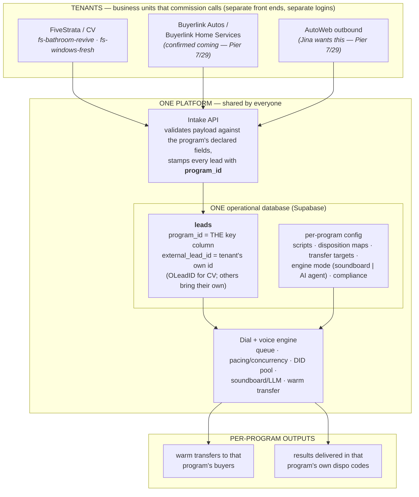

# Multi-Tenant Architecture — One-Page Explainer

The simple picture of how multiple business units share one platform. This page exists because
the topology confuses people; the detailed spec (schema, playbooks, taxonomies) lives in
[`tenant-program-onboarding.md`](tenant-program-onboarding.md). Alignment provenance: Sean↔Pier
sync 2026-07-29 ("your AI and my AI got confused about what was actually happening" — this is
the un-confused version). Last updated 2026-07-31.

## The one-sentence version

**Many front doors, one database, one engine** — every business unit pushes leads into the same
database tagged with a key, and a "campaign" is nothing more than a query on that key.

## The picture

## Vocabulary crosswalk (so the two mental models stop diverging)

| Pier's framing (7/29) | Platform term | Where it lives |
|---|---|---|
| "One database anyone can push to, as long as each contact meets certain headers" | Intake contract — per-program declared field schema | `program_field_defs` |
| "One of them being a unique field" | `external_lead_id` (OLeadID for CV; each tenant brings its own) | `leads.external_lead_id` |
| "Campaign is the unit — leads grouped by a key; just a database query on one column" | **Program** (the onboarding/config/reporting unit); campaigns/lists nest inside it | `programs`, `leads.program_id` |
| "AutoWeb logs into a completely different platform than CV" | Per-tenant front end / API surface — UI is separate; engine and DB are not | UI layer only |
| "CV is never going to see any AutoWeb leads" | Row-level security by tenant | Supabase RLS policies |
| "A Confluence doc that tells how to write to this database" | The playbook — versioned onboarding manifest, validated at `POST /programs` | `tenant-program-onboarding.md` |

## What is shared vs. what is separate

**Shared (built once, identical for every tenant):** the dial/voice engine, the per-dial +
per-turn fact stream, DID pool management, pacing/concurrency, the A/B harness, recording
capture, canonical disposition & sentiment taxonomies, the Snowflake results pipeline.

**Separate (config rows, never code):** front-end/login surface, lead payload shape, scripts,
disposition mappings, transfer destinations, compliance parameters, branding rules, engine mode
(soundboard vs. free AI agent — see `soundboard-llm-interface.md`).

**The test of success:** onboarding Buyerlink Autos touches **zero TypeScript and zero DDL** —
rows in the program tables plus a validated playbook.

## Worked example — three tenants, one dial

1. CV pushes a revived bathroom lead via LeadConduit → lands in `leads` with
   `program_id = fs-bathroom-revive`, `external_lead_id = <OLeadID>`.
2. AutoWeb pushes a trade-in prospect via its own endpoint token → same table,
   `program_id = aw-tradein`, its own id in `external_lead_id`.
3. The engine claims each from the same dial queue; each call runs that program's script,
   voice pack, and engine mode; dispositions are logged canonically and delivered back
   translated into each program's own codes.
4. CV's dashboard queries `WHERE program_id IN (CV's programs)` — RLS makes that the *only*
   thing it can see. Same for AutoWeb. One database, zero cross-contamination.

## Still open (tracked in `docs/open-questions.md`)

Legal/retention isolation per tenant (TCPA posture differs by industry) · per-tenant secret
management · playbook QA gate before go-live · DID pools shared vs. program-reserved
(spam-reputation isolation) · cost attribution per tenant-program.
