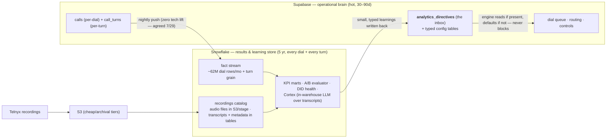

# Snowflake — What It's For and How Learnings Flow Back

Answers Pier's 7/29 concern ("Snowflake is a black box to me… I don't understand everything we
want to do with it") with the concrete list: what comes out, how it re-enters the operational
system, and why it beats staying on Supabase/MySQL alone. Sean, 2026-07-31. ➤ direction —
the *return-path contract* below must be in the V1 build even though Snowflake itself runs in
parallel (we don't need the learnings immediately; we DO need the ability to summon them when
available).

## The loop

## What comes OUT — actionable outputs and the KPIs they carry

Each row is: the prediction/analysis Snowflake runs → the directive it writes back → what the
platform does differently the next day.

| # | Prediction / KPI | Directive written back | Operational effect |
|---|---|---|---|
| 1 | **DID health score** — contact-rate decay per DID, answered-vs-dialed trend, spam-tagging signals | `retire_did(did, reason, score)` | DID manager retires/replaces the number. This *is* our "number reputation API" (Pier 7/29) — internal, free, and it's a 5-line query over the fact stream |
| 2 | **Clip/variant win rates** — per-turn grain: context → clip → outcome, controlled comparisons | `clip_ranking(program, node, ordered variants)` | Engine promotes winning variants, demotes losers; A/B tests conclude with stat-sig verdicts |
| 3 | **TTS-gap mining (the flywheel)** — cluster logged `speak()` texts weekly | `clip_candidates(cluster, transcript, freq)` | Top clusters get batch-generated as new clips → canned coverage ratchets up, cost/call down |
| 4 | **Soundboard evaluation** — canned-vs-TTS second split, cost per connected minute vs KB baseline | reporting only | The W1 economics verdict; the number Payam's revenue test needs |
| 5 | **Cadence/best-time-to-call uplift** per segment (vertical × age × geo × attempt #) | `queue_weights(segment, daypart weights)` | Dial queue reorders scheduling — the test-bench loop closed |
| 6 | **IVA/spam classification** — real-vs-fake contact model over call audio/turn features | `suppress(lead/number, class)` + the *trustworthy* contact-rate KPI | Stops wasting dials; fixes the KPI the human floors can't currently trust |
| 7 | **Revive propensity scoring** — which aged leads are worth dialing at all | `lead_scores(batch)` | Queue prioritization; lead consumption drops for the same sales |
| 8 | **Transfer-leg analytics** — client answer rates, tAtt/tSucc/tAgree by client × daypart | `transfer_weights(client, daypart)` | Two-phase selection fallback ordering gets data-driven |
| 9 | **Economics roll-up** — cost/sale, SPH vs KB/TD/CD baselines | reporting only | Exposure-ramp decisions; the augment-vs-replace scoreboard |

Rows 1, 3, and 5 are things we *already know we want* (7/22 + 7/29 meetings); the rest ride the
same rails. Note what's absent: no AI-insights on live data — live-ops stats stay simple
calculated fields in Supabase (Pier 7/28, agreed).

## The return path — "summon when available"

The V1 build carries the contract, not the analytics:

1. **One inbox table in Supabase** (`analytics_directives`: type, scope, payload jsonb,
   effective_at, applied_at, source_run) plus typed tables where a directive is hot-path
   (e.g. DID retirement queue).
2. **Engine hooks read-if-present-else-default.** Every consumer (queue ordering, DID pick,
   variant rotation, transfer fallback order) checks for a directive and falls back to the
   static default it ships with. No directive rows = exactly today's behavior.
3. **Async always** (standing architecture rule): the call path never queries Snowflake; the
   nightly job writes directives *into* Supabase. Snowflake being down for a week changes
   nothing operationally.
4. **Cost in V1: one migration + ~50 lines of read-hooks.** The Snowflake side can land weeks
   later without touching the engine.

## Recordings — why Snowflake is the obvious long-term home

We record every call long-term no matter what (decided). The pattern: **audio lands in S3**
(lifecycle-tiered to Glacier-class storage), **Snowflake external stage/directory tables
catalog it**, and transcripts + turn metadata live as first-class rows next to the fact
stream. That makes "pull every recording where the caller mentioned price in windows programs
last quarter" a SQL query (Cortex searches the transcripts), not an archaeology project.
Rough sizing: at ~8kbps mono opus, a connected minute is ~60 KB — a few TB/yr at pilot-to-scale
connected volumes, i.e. tens of dollars/mo in storage, not a budget line.

## Why not just Supabase/MySQL? (the benefits list)

- **Scale/grain:** ~62M per-dial rows/mo plus per-turn grain. OLAP queries over billions of
  rows are what Snowflake is for; Supabase is our OLTP brain and PostgREST caps reads at 1k
  rows/page — we literally cannot run the analytics there.
- **Workload isolation:** a heavy analyst query can never slow the dialer. Brandon gets a
  sandbox on the same data with zero operational risk — components of the system become
  individually optimizable instead of "don't touch the big thing."
- **Cost shape:** storage ≈ $23/TB/mo compressed; compute is pay-per-second only when queries
  run. Idle cost ≈ $0. The nightly push is a trivial batch job (agreed 7/29: "zero tech lift").
- **Cortex:** in-warehouse LLM functions over transcripts (QA scoring, objection clustering,
  the flywheel's clustering step) — and it consumes the same markdown knowledge files we
  already maintain for Claude, so the AI layer is portable.
- **Already ours:** enterprise account exists (AutoWeb impression-logging precedent, ~billions
  of rows), Shelly Teh owns it, AWS available. No new vendor, no new negotiation.
- **5-year retention** matches the results-DB decision (7/22) without bloating the hot store.

## What V1 actually builds (so scope stays honest)

| In V1 | In parallel / later |
|---|---|
| Nightly push of calls + call_turns to Snowflake | KPI marts, A/B evaluator, models (rows 1–9 above) |
| `analytics_directives` inbox + engine read-hooks | Cortex transcript mining |
| Recordings → S3 with catalog-ready naming | Directory tables / stage wiring, retention tiering |
