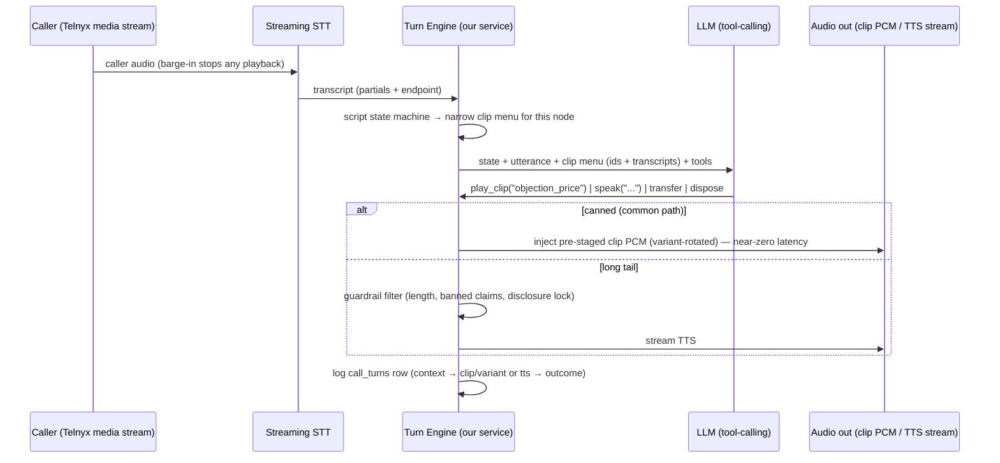

# Soundboard ↔ LLM+TTS Interface (W1 design)

How the soundboard paradigm interfaces with an LLM+TTS endpoint. Design note (Sean + Claude,
2026-07-28); feeds workstream W1 in `../PRD.md`. ➤ direction — hardens after the W1 latency PoC.

## The principle: the LLM presses buttons, it doesn't talk

A human soundboard operator listens live and fires hotkeys bound to clips. The interface that
replaces them is **constrained tool-calling**: per conversational turn, the LLM receives the
conversation state and a *menu* of currently-valid clips, and must respond with a tool call —
almost never free text.

```
tools:
  play_clip(intent, [reason])     -- the hotkey press (~80–95% of turns)
  speak(text)                     -- TTS escape hatch, guard-railed (the long tail)
  transfer(client_ref)            -- start the warm-transfer leg
  dispose(canonical_code)         -- end call with disposition
  wait()                          -- hold for more caller audio
```

The LLM's job is **classification and sequencing, not generation**. Because every clip carries
its transcript, the model reasons entirely in text; audio is somebody else's problem. This is
what makes the paradigm cheap (selection is a ~20-token tool call, not a 100-token generation),
fast (no synthesis wait on canned turns), compliant (the AI cannot say what isn't in the
library, except through one guarded gate), and loggable (the tool call **is** the per-turn
fact: `context → tool(args) → outcome` lands in `call_turns` with zero extra instrumentation).

## Turn loop



## The pieces that make it work

1. **Script as a state machine.** Clips are grouped by script node (greeting → qualify →
   objections → transfer setup). The engine narrows the menu to the current node's clips plus
   global handlers (objections, DNC, "who is this"). Smaller menus = faster and more accurate
   selection + structural script compliance. The state machine is playbook data (per program),
   not code.
2. **Variants below the LLM.** The model selects an *intent*; the engine picks which of the
   3–5 pre-generated variants plays (rotation, no same-call repeats — 7/22 direction) and logs
   `clip_variant`. The LLM never wastes tokens on variant choice.
3. **Guarded TTS gate.** `speak()` passes a filter: max length, banned-claims list, style
   check; **compliance disclosures can never come from `speak()`** — they are locked clips,
   bit-identical every call. Every `speak()` text is logged for QA.
4. **The library learns — the flywheel.** Cluster logged `speak()` texts weekly; batch-generate
   the top clusters as new clips in the voice pack. Canned coverage ratchets up, cost per call
   ratchets down, and the clip library converges on what real calls actually need. (Same loop
   improves the human floors: the clusters are literally "what the script is missing.")
5. **Voice continuity.** Clips are pre-generated with the same TTS voice used live, so the
   canned↔synthesized seam is inaudible (decided 7/17). A voice-pack swap replaces both at once.
6. **Latency budget (the W1 PoC measures each hop):** STT endpoint-of-speech → LLM tool call
   (short generation, small fast model; a larger model can audit asynchronously) → clip start.
   Canned turns skip synthesis entirely; pre-staged PCM in our media stream should start in
   tens of ms. Target: beat the human-operator hotkey seam (~200–400 ms perceived).

## Two integration shapes (the W1 bake-off)

| | A. BYO loop over Telnyx media streaming | B. Telnyx AI Assistant + custom LLM |
|---|---|---|
| Audio path | Bidirectional L16 stream to our service; we inject clip PCM directly or via `playback_start` (pre-staged Media Storage) | Telnyx runs STT/TTS/orchestration; our OpenAI-compatible endpoint returns responses |
| Soundboard fit | **Native** — full control of clip injection, barge-in, variant rotation | Depends on whether the Assistant can play pre-staged media as a tool action — ❓ unverified. Fallback trick: constrain LLM output to exact canned transcripts and rely on TTS caching of identical strings (soundboard economics via cache, if Telnyx caches) |
| STT/TTS | We choose engines (Telnyx Whisper $0.025/min; TTS per char) | Bundled from $0.05/min |
| Risk | We own latency engineering | Black-box latency; per-turn behavior less controllable |

Working assumption: **shape A** is where the soundboard paradigm lives comfortably; shape B is
the fast-start fallback if A's latency engineering runs long. Both keep the same tool-call
contract, so the turn engine and logging don't change — only the audio transport does.

## Why not "LLM writes text, TTS reads it" everywhere?

That's V1, and it's the $157/sale architecture: every turn pays generation tokens + synthesis
latency + per-minute TTS, the AI can improvise off-script (compliance risk), and decisions
aren't discretely loggable. The soundboard interface inverts the default: generation is the
exception, selection is the rule — which is also exactly what the human floors do, so per-turn
learnings transfer.
