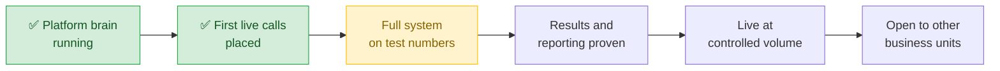

# CV AI Call Center — Where We're Going

*Shared overview · August 2026*

---

## What it is

An outbound calling platform that works leads a business already owns.

An AI voice makes the call, has the conversation, and connects anyone who's interested straight
through to whoever buys those calls. Every call is recorded, measured, and kept — so the calling
gets better the longer it runs.

Two things make it more than a call center:

**A team runs it themselves.** Build a calling effort, load the people, set the hours, pick the
voice, test two versions against each other, read the results — all from a screen, without an
engineer.

**Several business units share it, separately.** Each unit gets its own space with its own login.
The spaces are sealed off from each other. To each team it looks and feels like their own private
platform.

---

## Where we are

**Done.** The engine that decides who to call and when is built and running, with reporting in
place. And as of early August it works on real phone calls: the platform dials out, the call
connects, the AI voice speaks its side using pre-recorded audio, and every step is recorded
exactly as it happened. The full path — from "call this person" to a complete, logged call — is
proven.

**Now.** Building out the rest of the system and the screens a team works in, running on our own
test numbers so no real customers are called yet.

**Then.** Proving the reporting against numbers the business already trusts, going live on a small
share of real volume, and opening the platform to other business units.

---

## The steps ahead

| | What happens | Roughly when |
|---|---|---|
| **1** | **Everything a team touches gets built.** The screens, the calling controls, the phone-number management, the handoff to a buyer, the reports, the testing tools. Runs on internal test numbers only. | Mid-August |
| **2** | **The numbers get proven.** Results flow back into the business's own systems, so every report and dashboard they already use keeps working exactly as before. The team checks our numbers against what they already know. | Late August |
| **3** | **Live at a controlled pace.** Real leads, one product line, deliberately modest volume while the results are measured. | Early September |
| **4** | **Open to other business units.** A second unit sends leads and runs its own calling within days of finishing setup — no engineering on either side. | September |

Dates are targets we're working to, not commitments.

---

## What this looks like for a new business unit

Coming onto the platform is filling out a form, not starting a project. The answers become
settings. Nothing is custom-built, which is the whole point — it's why onboarding takes days
instead of a quarter.

| What we'd ask you for | Needed? |
|---|---|
| What you're selling, and the main talking points | Yes |
| At least one call script — with any legally required wording marked, so testing never changes it | Yes |
| The outcomes you want tracked — or use our ready-made list to start fast | Yes |
| Where your leads come from, and where an interested person should be sent | Yes |
| Your calling rules: hours, do-not-call handling, any states to avoid | Yes |
| The field names on your leads, if you have custom ones | Only if you do |
| What you'd expect for answer and conversion rates | Helpful, not required |

**This can be prepared now**, in parallel with everything above. It's the only piece that sits on
your side, so how soon a unit goes live depends mostly on how soon that's ready.

---

## What you'd get

- **Your own space.** Your leads, your scripts, your results. Invisible to every other unit on the
  platform.
- **Control without engineering.** Hours, scripts, voices, how often someone is retried, which
  numbers you call from, where interested people are sent — all settings a team member changes.
- **Testing built in.** Run two versions of anything side by side and see which one wins, live.
- **Reporting in your own terms.** Your outcome codes, your grain. Results also feed back into
  whatever systems you already run, so nothing downstream has to change.
- **Honest contact numbers.** Real people are counted separately from voicemails and screening
  robots, so the answer rate means what it says.
- **Phone numbers looked after for you.** The platform calls from a number local to the person
  being called, watches how each number is performing and how carriers are treating it, and
  retires and replaces numbers before they go stale.
- **Every call, kept.** Five years of recordings and call detail, searchable — including by what
  was actually said.
- **Calling that improves itself.** Each night the platform reviews the day's calls and adjusts
  going forward: which numbers to retire, when a given group actually answers, which script is
  winning.

---

## How we handle the sensitive parts

- We only call during the legal calling hours for where each person lives.
- We never call a number on a Do Not Call list, and a request to stop is honored everywhere,
  immediately.
- We never connect someone to a buyer unless the buyer's system has approved that person first.
  If that approval is slow or unclear, we don't place the call at all.
- Every one of those checks fails safe: if a check can't be completed, the answer is "don't call."
- Anything used on a real call can be switched off but never erased, so there's always a record.
- Everyone works under their own login. There are no shared passwords.

---

*Questions, or want to start on the setup? Talk to Pier Madsen or Sean Stott.*
