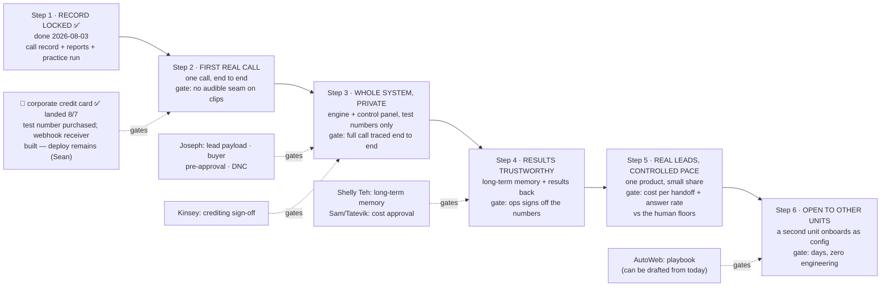

# CV AI Call Center — Roadmap

**Status:** Draft v2 (merged, 2026-08-07) — consolidates Pier's plain-language roadmap
(`roadmap-pier.md`, 8/6) and Sean's Draft v1.1 (8/5). Supersedes both. Built directly from
`PRD.md` Draft v2 — this document adds *sequencing and gates*, not scope. Scope was settled in
the PRD; §6 lists what this roadmap does not reopen.

The PRD says what we're building. This says the order we build it in, and roughly when. We build
the whole platform first, then start making real calls a few at a time, then open it up to other
business units. Steps 1–4 are the build order from PRD §9; steps 5–6 turn on real calls and open
the platform up.

**Dates are rough targets, not promises.** Step 2 waited on a company credit card — **landed
2026-08-07** (test number purchased same day); the remaining step-2 dependency is deploying the
webhook receiver (built 8/7 as a Supabase Edge Function — `supabase/functions/telnyx-webhook/`;
needs Sean's dashboard token, no IT dependency). A step is a demonstrable gate — a thing we can show working,
with a pass/fail criterion, that unlocks the next level of exposure. Every feature in PRD §6/§8
appears in exactly one step; the matrix in §3 is the checksum.

---

## 1. The steps

| Step | Target | External dependency on the critical path |
|---|---|---|
| 1 · Record locked | ✅ **done 2026-08-03** | — |
| 2 · First real call | **wiring proven 8/7** — first live call placed and traced end to end into `call_events`; voice loop (clip playback on answer) is the remaining gate half | none external — voice loop is our build |
| 3 · Whole system, private | ~1 week after step 2 (est. w/o 8/17) | Joseph: lead payload, buyer pre-approval contract, DNC surface · Kinsey: crediting rule |
| 4 · Results trustworthy | ~1 week after step 3 (est. w/o 8/24) | Shelly Teh: long-term memory landing · Cromwel/Joseph: results-back contract · Sam/Tatevik: cost approval |
| 5 · Real leads, controlled pace | w/o 8/31 | Ashley: final pilot script · switching on our share of incoming leads (Alex/Ashley) |
| 6 · Open to other units | September — gated by step 5 evidence and playbook readiness, **not by engineering** | AutoWeb playbook (trade-in acquisition is the named candidate, §5); drafting can start today, in parallel |

---

## 2. What each step builds

### Step 1 — Lock the standard call record ✅ *(done, early August)*

**What:** one standard format for everything we save about a call, at both grains — per dial and
per line of conversation — plus the reporting views built on top of it.

**Done when:** the format is locked and a practice run fills the live reports with test calls.
✅ Schema and views applied 2026-08-03 (13 objects verified); the simulated run fills the dashboard
live today. Telnyx keys validated 8/3.

**Why first:** reports, testing and every comparison are built on top of this, so it has to settle
before those can be built.

### Step 2 — Get one real call working

**What:** a single real call, end to end, as a throwaway test. An endpoint receives the lead, the
call goes out from the correct number, the three safety checks run (legal hours, allowed area,
buyer approval — PRD §5), the call runs on either the correct pre-recorded set or a selected
free-speech agent, and it follows the call-completion rules.

**Done when:** the endpoint receives a hit; the call runs from the correct number; the pre-recorded
lines play with a seam a human can't hear, or a free-speech agent runs correctly; and the
completion rules are followed.

**Wiring proven 2026-08-07** — the platform's **first real call** ran end to end the same day
the card landed: test number purchased, call path provisioned, webhook receiver deployed
(Supabase Edge Function; repoints to the platform's own home at step 3 with a one-line `.env`
change), and a live call placed from the platform DID, answered, and traced
`call.initiated → call.answered → call.hangup` into `call_events` through the signature-verified
webhook (`scripts/test-call.ts`). **Voice loop v0 ran the same day** (`scripts/voice-loop-test.ts`,
then `scripts/clip-loop-test.ts`): the platform spoke on live calls — first two TTS lines
(1300ms seam), then **pre-recorded clips from Telnyx media storage** with both seam strategies
measured in one call: **pre-queued ~550ms** (Telnyx queue-pickup floor; audio-format-independent)
vs **reactive ~1450ms** (dev-loop path). Remaining for the step-2 gate: the ~550ms floor means
Call Control playback alone doesn't reach no-audible-seam — the paths are clip-sequence
concatenation at authoring time (intra-turn seam → 0) and/or the media-streaming loop (the W1
bake-off's remaining question, now posed with real numbers). Voice quality itself is W6
(today's clips are Windows-TTS placeholders).

**Why it's the first real-world gate:** this is the cost line the whole architecture is built
around — pre-recorded lines replacing version one's per-minute generative pricing. Everything
downstream assumes it holds.

### Step 3 — Build the whole system and run it privately

**What:** the full platform, running on our own test numbers only, so no real people get called
yet.

- **Backend (PRD §7):** the operational brain (waiting line, safety checks, dial decisions,
  settings, recent history), the link to the phone layer, the long-term-storage wiring, and the
  control panel.
- **Features (PRD §6):** lead intake both ways, the Campaign builder and calling rules, phone
  number management, real-vs-voicemail detection, the handoff to a buyer, the reports, the live
  board, diagnostics, split testing, and the stop switches.
- **We define the standard way a business unit sends us leads and builds Campaigns. We set the
  format; we do not wait on theirs.**

**Done when:** the feature list is built out for this version, and a full call runs through every
step on test numbers where we can watch it live and trace what it did.

**Waiting on:** the buyer's pre-approval format (Joseph); the rule for when a handoff counts as a
sale (Kinsey).

**Exposure:** none. Full functionality, nobody outside the team sees it.

### Step 4 — Make the results trustworthy

**What:** every call saved in the standard format and copied into long-term memory each night.
Results sent back into the business unit's own system, keyed on the lead ID they already use, so
their existing reports keep working. The team checks that our numbers match what they already know.

**Done when:** the team agrees the reports are right, and a result makes it all the way back into
the business unit's system and survives the round trip.

**Waiting on:** long-term storage setup (Shelly Teh); results write-back format (Joseph, Cromwel);
sign-off on running costs (Sam, Tatevik).

**Why it matters:** this is where the revenue linkage becomes *measurable* rather than argued.

### Step 5 — Start calling real leads

**What:** real leads on one product, at a controlled pace matched to the human floors' rate.
Revived leads, one existing vertical, not home warranty. Clients aren't told yet.

**Done when:** calls run successfully at volume, and split testing is built out so we can start
optimizing.

**Waiting on:** the final pilot script (Ashley); switching on our share of the incoming leads.

**The exit is evidence, not a date:** cost per completed handoff and the honest answer rate,
against the human-floor baselines, decide whether volume scales.

### Step 6 — Open to other business units

**What:** open the platform for other business units to send us leads and build their own
Campaigns, with no new engineering.

**Done when:** a second business unit sends leads and runs a Campaign within days of finishing its
setup, with no engineering.

**Waiting on:** the business unit's setup details, which they can start filling out now.

---

## 3. Feature → step matrix (the checksum)

Every platform function mapped once. "Built at" = when it demonstrably works; scaffold code may
exist earlier, and much already does.

| Function | Built at | Gate it must pass |
|---|---|---|
| Standard call record, both grains (per dial + per line) | **Step 1 ✅** | practice run fills the dashboard live |
| Reports in the ops team's own grain | **Step 1 ✅** (built) → signed off at step 4 | ops confirms the views match their workbook |
| AI voice: line selection, per-line logging, pre-recorded-vs-free-speech telemetry, per-Campaign style selector | **Step 2** | no audible seam; cost-per-connected-minute model against the human-floor baseline |
| First voice pack (lines + variations for the pilot script) | **Step 2** (pipeline hardens through step 3) | first pack generated and playable |
| Lead intake — partner feed *and* file upload, label→Campaign adoption, DNC handling | **Step 3** | real payloads validate end to end |
| Waiting line: cadence settings, calling order, time-zone windows, concurrency-aware pacing | **Step 3** | paces to the bought ceiling and holds a tidy line at the limit |
| Phone number management: pool, area matching, health benchmarks, nightly retirement, **shared backup pool, never a single number** | **Step 3** | pool purchased, health counters live, nightly retirement wired |
| Warm handoff: **buyer approval before every dial**, re-check + fallback, bridge and introduction, all three stages logged | **Step 3** | bridged test handoff logged; crediting rule signed off |
| Real-vs-fake answer classification | **Step 3** | honest answer rate computes on private traffic |
| Stop switches (whole platform / one Campaign / one buyer), buyer priority order, volume limits | **Step 3** | a stop switch demonstrably halts dialing mid-run |
| Recording capture and storage | **Step 3** (capture) → step 4 (catalogued) | recordings land in our own storage from the first real call |
| Split testing | **Step 3** | two batches run two versions at once, attribution lands in the record |
| Control panel: live board, call history, recordings library, reports, funnel, diagnostics, alerts, builders, cost tracking | **Step 3** (✅ pulled forward, Sean 8/14: Vercel build starting now, AutoWeb demand; **no look-only tier** — screens ship with writes plumbed to live capabilities; scope in `architecture/control-panel-scope.md`) | every §6 feature reachable and correct |
| Roles and access: named login, Admin / Operator / Viewer, no erasing anything used live | **Step 3** | permission rules enforced, not just documented |
| Long-term memory: every dial and every line, 5-yr, results sent back to the partner system | **Step 4** | nightly copy lands both grains; a result survives the round trip |
| Overnight suggestions applied going forward | **Step 4** | a suggestion changes tomorrow's behavior without anyone re-entering it |
| Multi-business-unit: sealed spaces, playbook onboarding as config | core at **step 3** (label→Campaign resolution is in intake from the start) → proved at **step 6** | second unit live in days, zero engineering |

Pilot economics (step 5) is not a function — it's the exposure gate the whole stack exists to
pass.

---

## 4. Where the exposure ramp sits

Worth stating plainly, because it's the part most easily misread: **we are not phasing
functionality, we are ordering proof points.**

1. **Private** (step 3) — full platform, internal test numbers only. Everything works; nobody
   outside sees it.
2. **Quiet volume** (step 5) — revived leads, one vertical, a small share of the upstream split,
   paced to human-floor rates. Clients aren't told.
3. **Scale by evidence** (after step 5) — volume follows the answer rate and cost-per-handoff
   numbers; client conversations start when the numbers win.

---

## 5. How another business unit sets up

A business unit comes on by answering the Campaign setup questions. The answers become settings,
not new code. AutoWeb is the named second unit; **trade-in acquisition** is the named candidate
program, and the playbook can be drafted **now, in parallel** with steps 2–5 — it's the only
unit-side item on the step 6 path, so step 6's date is set by step 5 evidence plus playbook
readiness, not by a build queue.

| Setup question | Needed? | What the business unit gives |
|---|---|---|
| What are you selling? | Yes | The offer and the basic talking points |
| The script | Yes | At least one call script, with any legally required lines marked so a test never changes them |
| Which outcomes to track | Yes | The results they want recorded, or our ready-made list for a fast start |
| Extra details on their leads | Only if they have them | The field names, so we can check the leads coming in |
| Where leads come in, where interested people go | Yes | A source for leads in, and a sales line or results feed out |
| Calling rules | Yes | Calling hours, do-not-call handling, any states to avoid |
| Expected numbers | Helpful | Their expected answer and sale rates, so their reports start with something to compare against |

Two things make this cheap on their side. **Step 3 is when the core they'd run on is complete** —
label-to-Campaign resolution is in the intake path from the start, not retrofitted. And **step 5 is
CV proving the platform on its own leads** — by the time another unit dials, the economics, the
carrier hygiene and the honest answer rates are already demonstrated. Reporting comparability is
free: every unit's outcomes map onto one shared dictionary, so their numbers read against CV's with
no translation work.

---

## 6. Open items, forced to a deadline

Nothing on this list holds up a step. Each has an owner, a due step, and a ➤ proposed default that
stands if no decision arrives by then. (Defaults are directions, not decisions, until their due
date passes.)

| Open item | Owner | Due by | ➤ Default if unresolved |
|---|---|---|---|
| Phone provider's negotiated pricing and the handoff fee | Pier | Step 4 | use list pricing in the cost model |
| Lead payload spec + buyer pre-approval contract | Joseph | Step 3 | emulate today's call-center contract verbatim |
| Do Not Call: clean leads only, or do we re-check ourselves? | Joseph | Step 3 | we re-check at intake, as a backstop |
| Standard format for sending results back | Joseph, Cromwel, Brandon | Step 4 | one standard call-result format every business unit uses; mirror today's ingestion pattern |
| What happens when a buyer doesn't pick up a handoff | Kinsey | Step 3 | AI offers a callback and saves the requested time; outcome logged as a failed connect — **we are still credited for the attempt** (✅ 7/29) |
| What counts as success | Pier, Sean → Payam | Start of step 5 | platform bar: outbound at scale, self-serve, split testing, multiple business units (PRD §11 first list). Volume bar for the CV pilot: beat the human floors' cost per completed handoff (~$25–35) at no worse than their honest answer rate |
| Recording consent in states that require notification | Pier, Sean | Step 5 | play a recorded-line disclosure in every two-party-consent state |
| How each unit's keys and credentials are stored | Sean | Step 6 | per-unit secrets, held outside the code, scoped to that unit only |
| Whether one lead label can feed more than one Campaign | Sean, Pier | Step 3 | one-to-one |
| What to call from when we own no local number | Sean, Ashley | Step 3 | shared backup pool (per the 7/31 study) — never a single number |
| How long recent calls stay in fast storage | Sean | Step 4 | about 90 days |
| How the nightly copy runs | Sean, Shelly | Step 4 | nightly incremental sync (per `architecture/snowflake-value.md`, 8/3) |
| How many phone numbers to start with | Sean, Ashley | Step 3 | 50–100, dropping bad ones from day one, always with a backup group |
| Where recordings are stored | Sean, Shelly | Step 3 capture / step 4 catalogue | cheap object storage, catalogued in long-term memory |
| AutoWeb program pick and playbook owner | Jina, Ammie (via Pier) | Start of step 5 | trade-in acquisition, using our ready-made outcome list for a fast start |

---

## 7. What this roadmap does not reopen

Settled, with provenance — raising these again takes new evidence, not preference:

No dialer instance of our own, vocabulary kept (✅ PRD v1 7/27; fork closed 7/23 `ac4357e`) ·
Supabase brain + Telnyx call path + Snowflake long-term memory (✅ PRD v1) · pre-recorded lines
first, the AI as the soundboard operator (✅ PRD v1) · no human screener or closer (✅ PRD v1) ·
buyer approval before every dial (✅ 7/29) · credited on the transfer *attempt* (✅ 7/29) ·
per-Campaign voice style with graduation between styles (✅ 7/29) · concurrency-aware from day one
(✅ 7/29) · the Campaign as the one object a team works with (✅ Pier draft 8/6) · named-user login
and no erasing anything used live (✅ Pier draft 8/6) · version two built fresh (✅ Pier draft 8/6) ·
one build with exposure ramps, not build phases (✅ PRD §1/§4 here) · revived leads, one existing
vertical, not home warranty for the pilot (✅ 7/17) · sealed-off business units with playbook
onboarding (✅ 7/23) · augment the human floors, don't replace them (settled by V1).
