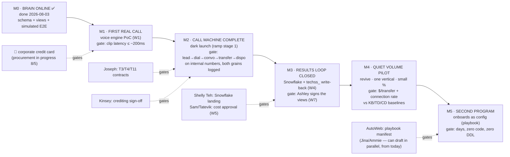

# AICC Roadmap — Functions → Milestones

**Status:** Draft v1.1 (Sean, 2026-08-05), requested by Pier — the ask originates with **Jina
Yoon and Ammie Lin (AutoWeb)**, who read this from the AutoWeb-onboarding perspective; §3b is
addressed to them. Derived 1:1 from `PRD.md` Draft v1 — this document adds *sequencing and
gates*, not scope. Scope questions were settled in the PRD; see §5 ("What this roadmap does not
reopen").

**How to read it:** the PRD's stance is **one build, exposure ramps** — we are not phasing
functionality, we are ordering *proof points*. A milestone is a demonstrable gate: a thing we can
show working, with a pass/fail criterion, that unlocks the next level of exposure. Every P0
function from PRD §4 appears in exactly one milestone (the matrix in §2 is the checksum).

---

## 1. The milestones

Target dates (planning targets, not commitments — M1 floats on the card, everything downstream
floats with it):

| Milestone | Target | External dependency on the critical path |
|---|---|---|
| M0 Brain online | ✅ **done 2026-08-03** | — |
| M1 First real call | ~1 week after card lands (est. w/o 8/10) | **Credit card** (test-DID purchase) · public webhook endpoint (IT tunnel/deploy) |
| M2 Call machine complete (dark) | ~1 week after M1 (est. w/o 8/17) | Joseph: LeadConduit payload (T3/F8), pre-auth contract (T4), DNC surface (T11) · Kinsey: crediting rule |
| M3 Results loop closed | ~1 week after M2 (est. w/o 8/24) | Shelly Teh: Snowflake landing (T8) · Cromwel/Joseph: write-back contract (T6) · Sam/Tatevik: cost approval (W5) |
| M4 Quiet volume pilot | w/o 8/31 | Ashley: pilot-vertical script final · upstream split % change (Alex/Ashley) |
| M5 Second program | September — gated by M4 evidence + playbook readiness, **not engineering** | AutoWeb program playbook (trade-in acquisition is the named candidate — see §3b); drafting can start today, in parallel with M1–M4 |

---

## 2. Function → milestone matrix (the checksum)

Every PRD §4 P0 function, mapped once. "Built at" = when it demonstrably works; scaffold code may
exist earlier (much already does).

| P0 # | Function (PRD §4) | Built at | Gate it must pass | Workstream |
|---|---|---|---|---|
| 12 | Reporting in Ashley's grain (rDaily/rList views) | **M0 ✅** (views built, migration 0002) → sign-off at M3 | Ashley confirms views match her workbook | W7 |
| — | Operational schema, both fact grains (per-dial + per-turn) | **M0 ✅** (migration 0001, 13 objects verified) | simulated E2E fills dashboard live | — |
| 7 | AI agent, soundboard-first (clip selection · per-turn logging · canned-vs-TTS telemetry · engine selector) | **M1** | clip playback latency ≤ human-soundboard seam (~200ms); cost/connected-min model vs KB baseline | W1 |
| — | Voice pack v0 (clips + variants for pilot script) | **M1** (pipeline hardens through M2) | first pack generated and playable | W6 |
| 5 | Intake API (LeadConduit recipient + revive endpoint · DNC inheritance · FS-code parsing) | **M2** | real payloads validate end-to-end | W3 |
| 6 | Dial queue (cadence variables · LIFO/FIFO · TZ windows · concurrency-aware slot-ledger pacer) | **M2** | paces to configured caps with event-driven backpressure | — |
| 3 | DID management (pool buy/rotate/retire · per-DID benchmarks · caps · **pool fallback, never single CID**) | **M2** | pool purchased, benchmark counters live, nightly retire directive wired | — |
| 8 | Warm-transfer leg (**pre-auth at dial time, every dial** · re-check + fallback · bridge + whisper · tAtt/tSucc/tAgree) | **M2** | bridged test transfer logged; crediting rule signed off by Kinsey | W2 |
| 9 | IVA/connection classification (AMD + live IVA disposition) | **M2** | IVA-adjusted connection rate computes on dark-launch traffic | — |
| 10 | Ops controls (kill switches global/program/SC×CP · transfer priorities · throttles) | **M2** | kill switch demonstrably halts dialing mid-run | — |
| 2 | Recording storage (everything archived, FS-owned, 5-yr; hot analysis window) | **M2** (capture) → M3 (catalog in Snowflake) | recordings land in FS-owned storage from first real call | — |
| 4 | A/B harness (batch → agent/script/voice-pack/cadence variant assignment) | **M2** | two batches run two variants concurrently, attribution lands in fact stream | — |
| 1 | Results DB (Snowflake, every dial + turn, OLeadID-keyed · techss_ write-back · `analytics_directives` return path) | **M3** | nightly sync lands both grains; a write-back row survives round-trip to techss_ | W4 |
| 11 | Multi-tenant topology (tenant→program · playbook onboarding as config) | core at **M2** (program resolution in intake) → proof at **M5** | second program live in days, zero code, zero DDL | — |

Pilot economics (M4) is not a function — it's the exposure gate the whole stack exists to pass:
$/qualified-transfer vs KB ($25–35), IVA-adjusted connection rate, SPH-equivalent, canned-coverage %.

---

## 3. What each milestone proves (talking points)

- **M0 — the brain exists.** Supabase schema (13 objects), Ashley-grain reporting views, and a
  simulated lead→dial→turn→disposition pipeline filling a live dashboard. Already demonstrable
  today with `demo-simulate`. Telnyx keys validated (T2 closed 8/3).
- **M1 — the voice thesis holds.** One real outbound call where the AI fires canned clips with a
  seam a human can't hear — a scalable soundboard + TTS model. This is the cost line the whole
  architecture is built around (clips replace V1's per-minute generative pricing), which is why
  it's the first real-world gate and sits directly behind the credit card.
- **M2 — the whole machine runs dark.** Every call-path function live against internal test
  numbers. Nothing outside the team sees it. This is PRD §7 ramp stage 1 — full functionality,
  zero exposure.
- **M3 — the data promise is kept.** Every dial and every turn in Snowflake, dispositions flowing
  back into techss_ so the MDB and every downstream dashboard keep working, and Ashley agreeing
  the views are her workbook. Revenue linkage becomes *measurable* here.
- **M4 — the business case gets its number.** Small % of revive volume, one vertical, paced to
  human-floor rates. Exit is evidence, not a date: $/transfer and connection rate against the
  KB/TD/CD baselines decide whether volume scales (ramp stage 3).
- **M5 — new programs launch as configuration.** A second program (different tenant if possible)
  onboards via playbook manifest in days, with no new engineering — PRD §2b working in practice.

---

## 3b. The AutoWeb lens (for Jina & Ammie)

The platform was designed tenant-agnostic from the first schema migration — **the CV call
center is the first workload, not the product** (PRD §2b). AutoWeb is the named second tenant.
What that means concretely for an AutoWeb program:

**Onboarding is a manifest, not a project.** A program onboards by submitting a versioned
playbook manifest that becomes config rows — zero code, zero schema change
(`architecture/tenant-program-onboarding.md`). What AutoWeb brings:

| Playbook section | Req? | AutoWeb supplies |
|---|---|---|
| Product profile | ✅ | Offer, talk-track facts, objection handling (e.g. trade-in valuation basics) |
| Scripts & disclosures | ✅ | One call script minimum; compliance disclosures flagged (locked, never A/B'd) |
| Dispositions | ✅ | Required codes mapped to canonical — or accept platform defaults for a fast start |
| Lead field schema | if custom | Field defs for intake validation |
| Connections | ✅ ≥1 | Lead source in; transfer destination (SIP/PSTN) or results ETL out; recording delivery |
| Compliance | ✅ | Calling hours, DNC policy/feed, state exclusions |
| Benchmarks | ➤ rec. | Expected contact/conversion — seeds their reporting from day one |

**How the milestones read from the AutoWeb chair:**

- **M2** is when the core AutoWeb would run on is complete — program resolution is in the
  intake path from the start, not retrofitted.
- **M4 is FiveStrata proving the platform on its own leads.** By the time an AutoWeb program
  dials, the economics ($/transfer vs human-floor baselines), carrier hygiene, and IVA-adjusted
  connection rates are already demonstrated on CV revive traffic.
- **M5 is an AutoWeb program live** — the gate is *days from manifest to first dial, zero
  engineering*. Named candidate: **trade-in acquisition** (PRD §2b). The playbook can be
  drafted **now, in parallel** — it's the only AutoWeb-side item on the M5 path, so M5's date
  is set by M4 evidence plus AutoWeb's manifest readiness, not by a build queue.
- Reporting comparability is free: every program's dispositions map to one canonical
  dictionary, so AutoWeb KPIs read against CV benchmarks with no translation work.

❓ Scope note: **SMS follow-up** (Payam via Andre) is a *channel* extension — the P0
platform is voice-first. The queue/program/fact-stream design accommodates it, but it is not
in the M0–M5 scope and would be its own scoped addition after M5.

---

## 4. Open items, forced to a deadline

The design intent: nothing on this list holds up a milestone — each has an owner, a due
milestone, and a ➤ proposed default that stands if no decision arrives by then. (Defaults are
directions, not decisions, until their due date passes — provenance rule intact.)

| Open item | Owner | Due by | ➤ Proposed default if unresolved |
|---|---|---|---|
| Telnyx negotiated pricing + warm-transfer fee scope | Pier | M3 (cost model) | list pricing in the cost model |
| LeadConduit payload spec (F8) + pre-auth request/response contract (T4) | Joseph | M2 | emulate today's call-center contract verbatim |
| DNC inheritance — pre-scrubbed only, or platform-side scrub? (T11) | Joseph | M2 | platform re-checks `dncDate` at intake (belt-and-suspenders) |
| techss_ write-back contract (T6) + disposition dictionary | Joseph/Cromwel/Brandon | M3 | mirror the TD_* ingestion pattern |
| Client no-answer path on warm transfer | Kinsey | M2 | AI offers callback, disposition logged as tSucc-fail; FS still credited for attempt (✅ 7/29) |
| Formal pilot success thresholds | Sean+Pier → Payam | M4 start | beat KB $/qualified-transfer ($25–35) at ≥ human-floor IVA-adjusted connection rate |
| Hot-window length (30–90d) | Sean | M3 | 90 days |
| CDC route to Snowflake | Sean/Shelly | M3 | nightly incremental watermark sync (per `snowflake-value.md`, 8/3 analysis) |
| Pilot DID pool size | Sean/Ashley | M2 | start ~50–100 DIDs, benchmark-retire from day one; pool fallback per 7/31 study |
| Recordings storage target | Sean/Shelly | M2 capture / M3 catalog | S3, cataloged in Snowflake (per `snowflake-value.md`) |
| AutoWeb M5 program pick + playbook owner | Jina/Ammie (via Pier) | M4 start | trade-in acquisition, platform-default dispositions (fast-start path) |

## 5. What this roadmap does not reopen

Settled, with provenance — raising these again requires new evidence, not preference:

no ViciDial instance (✅ PRD v1, 7/27; A/B/C fork closed 7/23 `ac4357e`) · Supabase brain +
Telnyx path + Snowflake results (✅ PRD v1) · soundboard-first hybrid voice, AI as the soundboard
operator (✅ PRD v1) · no human screener/closer (✅ PRD v1) · pre-auth at dial time, every dial
(✅ 7/29 Sean↔Pier↔Joseph) · crediting on transfer *attempt* (✅ 7/29) · per-program engine
selector (✅ 7/29) · concurrency-aware queue from day one (✅ 7/29) · one build / exposure ramp,
not build phases (✅ PRD §1/§7) · revive-first pilot, existing vertical, not HW (✅ 7/17) ·
multi-tenant playbook onboarding (✅ 7/23) · augment-not-replace (settled by V1).
